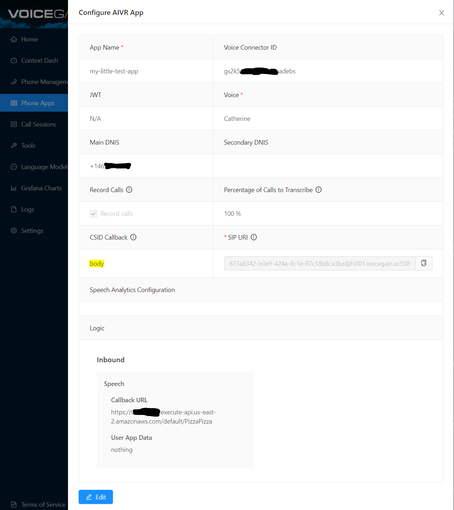

# Declarative IVR

This folder contains an AWS Lambda python script that together with Voicegain Telephony Bot API offers an easy method for building simple to moderately complex IVRs. 

The declarative IVR has built-in logic for re-prompts and confirmations, making it easier to develop the IVR app logic.

## Files
* LICENSE.md - MIT license
* declarativeIVRLambda.py - the python code to be deployed on AWS Lambda
* **outbound-survey-ivr.yaml - sample IVR definition in YAML format - this implements an outbound survey**
* outbound-survey-ivr.json - JSON file converted from the above YAML  
* twilio-dial-outbound.py - sample python script that makes an outbound call from Twilio and connects it to Voicegain Telephone Bot API
* telnyx-dial-outbound-lambda.py - sample python script for AWS Lambda function that makes an outbound call from Telnyx and connects it to Voicegain Telephone Bot API

## The declarative YAML for specifying IVR: actions

Below are examples of all available IVR actions:

### VOID
```
  type: VOID
  next: Welcome
```
Does not do anything except specifying next action to execute. Useful e.g. for joining multiple paths in the flow, or logically partitioning the flow.

### OUTPUT
```
  type: OUTPUT
  voice: catherine
  prompt: |
    Hello, this is a call from Santa North Pole, LLC. 
    We would like to ask you a few questions regarding your satisfaction with the recent visit from Santa. 
    It will not take more than two minutes.  
  next: AgreeToParticipate
```
Specifies the prompt to be played and the voice to use (if diferent from the default voice).
Prompt text supports variable substitution.

### INPUT
```
  type: INPUT
  name: agreeToParticipate
  voice: catherine
  prompt: 'Would you like to participate now, or would you rather have us call you later.'
  bargeIn: true
  grammar: 
  - participate
  noInputMax: 1
  noMatchMax: 1
  confirmation:
    threshold: 0.33
    prompt: "Was it: ${agreeToParticipate} ?"
  fail: CallHealth
  next: ParticipateDecision  
```
Used to play a question prompt and gather input.
* More than one grammar is allowed. This makes it possible to handle both speech and DTMF input.
* semantic result of the grammar recognition will be assigned to a variable specified with `name`
* In case of NOINPUT or NOMATCH the specified number of re-prompts will be automatically performed.
* It is possible to do automatic confirmation question if confidence is below a set threshold
* in case of too many NOINPUT or NOMATCH  the specified  `fail` action will be executed.

### EVAL
```
  type: EVAL
  eval: "'${agreeToParticipate}'"
  case:
  - expr: "'${1}'=='now'"
    next: ParticipateNow
  - expr: "'${1}'=='later'"
    next: ParticipateLater
  next: ParticipateNever
```

Used to do expression evaluation and branching. Can reference variables collected during the IVR flow. External variables can be injected at the start of the session

The `case` expression allows for branching. It evaluates expressions in sequence and the first one evaluating to **true** will be taken. Special variable `${1}` can be used to reference the result of `eval`

Note tha you may modify the AWS Lambda python script and introduce your own functions and variables that may be used in EVAL.

### DISCONNECT
```
  type: DISCONNECT
  voice: catherine
  prompt: Thank you for your time, goodbye.
  reason: NORMAL
```
Plays the specified prompt and disconnects the call. Disconnect will result either in a hangup (is the call was a top level call) or a transfer back to the invoking call if the call was bridged from another call.

The `reason` will be stored in the session.

### TRANSFER
```
  type: TRANSFER
  voice: catherine
  prompt: Let me transfer you.
  phone: "+18174112106"
```


## The declarative YAML for specifying IVR: special elements

The YAML has several special elements:

### ENTRY
```
ENTRY:
  type: VOID
  voice: catherine
  next: Welcome
```
The first action executed when the call comes in.

### ERROR
```
ERROR:
  type: DISCONNECT
  voice: catherine
  prompt: Sorry, there was an error. Please call back later
  reason: ERROR
```

Action executed if there was an error.

### DEFAULTS
```
DEFAULTS:
  prefixes:
    noInput:
    - Sorry, I did not hear it.
    - Sorry, I still did not hear it.
    noMatch:
    - Sorry, I did not get it.
    - Sorry, I still did not get it.
  repromtOnDisconfirm: Sorry, let's try again.
  thresholds:
    confirmation: 0.75
```
Various defaults for the IVR application

### GRAMMARS
```
GRAMMARS:
  ## will callee participate
  participate:
    type: JJSGF
    parameters:
      tag-format: semantics/1.0-literals
    grammar: participate
    public:
      root: "(<now> {now}) | (<later> {later}) | (<never> {never})"
    rules:
      now: "(yes [participate] [now]) | ([participate] now)"
      later: "(later)"
      never: "(no) | (never)"
  ## answer to question about Santa eating cookies
  yesNoCookies:
    type: JJSGF
    parameters:
      tag-format: semantics/1.0-literals
    grammar: ateAllCookies
    public:
      root: "(<yes> {yes}) | (<no> {no})"
    rules:
      yes: "(yes [he] [ate [them]] [all])"
      no: "(no [he didn't [eat them [all]]])" 
```
Place to define the grammars. They can be then referenced from INPUT actions.

## How It works

To configure and run the IVR you need:
* Account with Voicegain
* A Phone App configured via Voicegain Web Console
* A phone number, e.g. from Twilio or SignalWire
  * You can also purchase a phone number from Voicegain, but currently we do no support outbound calling
  * If you are using Twilio or SignalWire you will have to plug Voicegain SIP URI (see image below) into those platforms, for example see: `twilio-dial-outbound.py`
* Account with AWS
    * You will use AWS Lambda to host the python script that interprets the declarative IVR.
    * S3 will be used to host the configuration script. 
    * Note: You could also modify the script to run on your own server (the script is under MIT License) and you also can host the script elsewhere (just need to modify the code that retrieves it).
* The YAML file where you put your IVR definition

You need to tie the Voicegain Phone App to the Lambda function url using the callback URL, see image below. Note, in the image we have a DNIS defined - if you are using Twilio or SignalWire this is not needed.



Note: currently the declarativeIVRLambda.py can read only json, so you will need to convert YAML to JSON before deployment. (Lambda does not natively support libraries for YAML->JSON conversion.)
