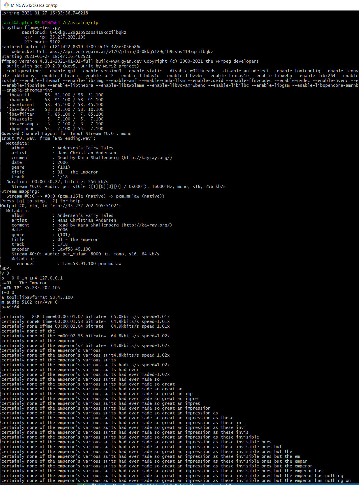

## Prerequisites
* Python - to prepare this example we used version **3.8.3**
* Account with Voicegain: https://console.voicegain.ai/signup
* JWT token for authentication: https://support.voicegain.ai/hc/en-us/articles/360028023691-JWT-Authentication

# ffmpeg-rtp-ws.py

Before running you will need to install:
```
pip install websockets
pip install ffmpy
```
This python script does the following:
* starts Voicegain transcription session configured for:
    * audio input via RTP stream
    * result of transcription sent incrementally via websocket 
* opens an audio file using `ffmpeg`
* uses `ffmpeg` to stream audio real-time to RTP ip:port provided in response to opening Voicegain session
* opens websocket to url provided in response to opening Voicegain session
* receives messages via websocket and assembles them into transcript which is printed to console

NOTE: RTP streaming uses UDP so if the load on your test machine is very high or the connection to internet is indirect (e.g. via VPN) then recognition result may be affected by UDP packet loss.  

Here is a Zendesk article that discusses the various parts for the ffmpeg-rtp-ws.py code:
https://support.voicegain.ai/hc/en-us/articles/360055973591-Example-of-streaming-audio-via-RTP-and-receiving-result-via-websocket  

If everything is fine you can expect the following output:
 

# ffmpeg-rtp-ws-with-diarization.py

Similar to ffmpeg-rtp-ws.py but uses a real-time diarization to transcribe a wav file with a two-speaker conversation. Words of the second speaker are printed in uppercase.

# ffpmeg-grammar-test.py

Illustrates recognition using a built-in credit card grammar. In this example the recognition result will come back over websocket as a single message so there is no need for processing small component messages into a final whole like in case of real-time transcription. 

Note: the credit card numbers in the sample files are just made up. good_cc.wav has been constructed to pass the Luhn checksum.