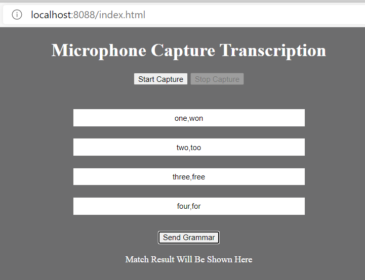
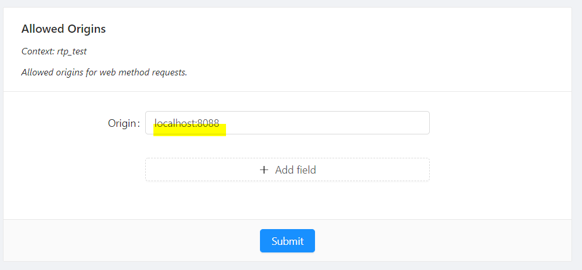

# About

This example is a simple web app which illustrates use of continuous recognition using grammars.
The app takes spoken commands and highlights the UI element that has the command.
The audio is obtained from microphone via web browser, the streamed to Voicegain Recognition in the Cloud.
The results are sent back via another websocket.

# The App UI

You can define the 4-command grammar but entering the phrases into the 4 text boxes.
Alternatives should be separated by comma.
Once entered press "Send Grammar"
Then click "Start Capture" for the app to start listening.
Press "Stop Capture" to stop.

# How to Run

## Prerequisites
* Account with Voicegain: https://console.voicegain.ai/signup
* JWT token for authentication: https://support.voicegain.ai/hc/en-us/articles/360028023691-JWT-Authentication

## CORS Configuration

The allowed origin must be added in the API Security settings menu under settings on the console to prevent CORS 403 error from occuring.

1. Switch to the Context that you have used to generate JWT 
1. Go to API Security settings page under the settings menu in the side bar of the console.
1. In the Allowed Origins settings input, enter the origin on which the index.html page is running on (localhost:8080 etc.)
1. Press save to save the settings.

*Example CORS setting in the Web Console*

## Steps to Run ##

1. Install node js - https://nodejs.org/en/download/
1. Set JWT and `aud` origin in server.js - `aud` setting has to match the CORS setting made above.
1. Run command `npm install` in project directory to install dependencies
1. To start server, run command `node server.js` while in project directory
1. Open index.html in browser (you can use `http-server` from npm to serve the page, e.g., `http-server -c5 -p8088`)

**NOTE:** this example with run on Chrome and latest Edge browsers.
It will not run on Firefox because of inability to set the audio sample rate.

# The Files

The files contained in this example are:
* package.json - dependencies required for `npm install`
* index.html - the HTML document for the app
* styles.css - styles used in index.html
* server.js - local Node JS server - used to generate temporary JWT from the permanent JWT token
* audio-services.js - code for dealing with the audio device
* microphone-capture.js - main logic of the application
  * makes request to Voicegain recognize API to start recognition session
  * opens connection to audio websocket for streaming audio to Voicegain Cloud
  * opens connection to the results websocket for receiving the results of recognition. 