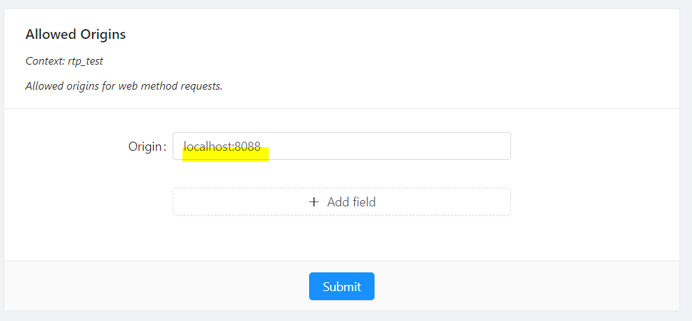

# Microphone capture with diarization (sample code) - node.js version 

What this code demonstrates:
* microphone capture (with diarization setting) in a browser
* sending captured audio over one websocket
* receiving transcribed text over another websocket
* processing messages returned from Voicegain - in `microphone-capture.js` under `//Handle corrections/deletions of words` (this is for live preview)
* submitting captured audio for offline transcription and diarization
* waiting for the transcription to be complwted
* retrieving complete transcript and showing it with speaker info

## Prerequisites
* Account with Voicegain: https://console.voicegain.ai/signup
* JWT token for authentication: https://support.voicegain.ai/hc/en-us/articles/360028023691-JWT-Authentication

## CORS Configuration

The allowed origin **must** be added in the API Security settings menu under settings on the console to prevent CORS 403 error from occuring (if this example is not working check responses in F12 browser console - most likely you will see 403 errors)

1. Switch to the Context that you have used to generate JWT 
1. Go to API Security settings page under the settings menu in the side bar of the console.
1. In the Allowed Origins settings input, enter the origin on which the index.html page is running on (localhost:8088 etc.)
1. Press save to save the settings.


*Example CORS setting in the Web Console*

## Steps to Run ##

1. Install node js - https://nodejs.org/en/download/
1. Set JWT in server.js.
1. Run command "npm install" in project directory to install dependencies
1. To start server, run command "node server.js" while in project directory
1. Open index.html in browser, e.g., http://localhost:8088/ 

**NOTE:** this example with run on Chrome and latest Edge browsers.
It will not run on Firefox because of inability to set the audio sample rate.
For Firefox you need to read the actual sample rate and pass it in the body of the request to https://api.voicegain.ai/v1/asr/transcribe/async 

</br>

 *Screenshot of the microphone capture app running.*

## Tweaks ##

You can control the delay and the amount of corrections by modifying the `minimumDelay` parameter in file microphone-capture.js

```
websocket: { adHoc: true, minimumDelay: 175, useSTOMP: false },
```

`minimumDelay` = 0 will give fastest response but also most corrections. You can increase the value of `minimumDelay` if you do not mind some delay but would like to see fewer rewrites of the text.

## API ##

The core API used is documented here: https://console.voicegain.ai/api-documentation#operation/asrTranscribeAsyncPost

If you want to know the format of the messages sent over webscoket look here: https://console.voicegain.ai/api-documentation#operation/wsTranscribeWords

BTW, you need to be logged into the Voicegain Web Console for these links to work.
