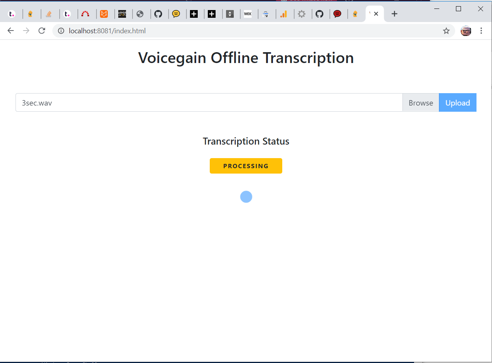

# Voicegain offline transcription demo - node.js version #

Requires Voicegain Platform Release 1.9.0 or higher

## Intro ##

What this code demonstrates:
* hiding JWT on the server side
* upload of file from browser to Voicegain storage
* submit it to offline transcription
* poll until transcription is finished
* show the text result of transcription

## Steps to Install and Run ##

1. In the Voicegain Portal add `localhost:8081` to allowed domains (Settings ->  API Security) - this is needed to prevent CORS rejects in the browser
1. Install node js - https://nodejs.org/en/download/
1. Set JWT in `server.js` 
1. Run command `npm install` in project directory to install dependencies
1. To start server, run command `node server.js` while in project directory
1. In a different terminal window start `http-server`
1. In a web browser goto `http://localhost:8081/index.html` (we are assuming that http-server will run on 8081 port as node.js is using 8080)

## Notes about the code ##

### server.js ### 

Encapsulates Voicegain API to generate short-lived JWT tokens that are needed to make all the other Voicegain Web API requests. 

This file contains your Voicegain account JWT token (in `<Your JWT Here>`) that gives you access to all the Voicegain APIs. It is important to hide it on the server side, otherwise, someone could get easy access to it and run up API requests on your account and you would have to pay for someone else's usage.

In the `server.js` included in this demo we set the short-lived JWT token parameters to:
* `aud: "localhost:8081"` - this is the authorized domain for this token
* `expInSec: 3600` - this is the expiry time of the short lived token - setting it to 1 hour is a bit extreme, so we suggest using smaller values in prod applications.

### upload.js ### 

This is the main javascript for the application. It contains:
* Fetching of the short-lived JWT from node.js server `http://localhost:8080/api/jwt` 
* Audio file upload using `POST https://api.voicegain.ai/v1/data/file` API
* Start of asynchronous transcription of the uploaded file using `POST https://api.voicegain.ai/v1/asr/transcribe/async` API
* Periodic polling of the status of transcription using `GET https://api.voicegain.ai/v1/asr/transcribe/${sessionId}` API
  * note that we set `full=true` in the polling query as we are not interested in the incremental transcription results - just the final one
* When `result.final==true`, the retrieval of the text transcript from the polling response.

### Possible extensions ###

Voicegain API provides `GET https://api.voicegain.ai/v1//asr/transcribe/{sessionId}/transcript` API that allows download of the final transcript in a variety of formats:
* json - complete transcript data with all detail for each word
* text - plaint text transcript with optional timing information
* srt - transcript in SRT caption format
* vtt - transcript in WebVTT caption format
* ttml - transcript in TTML (XML) caption format

