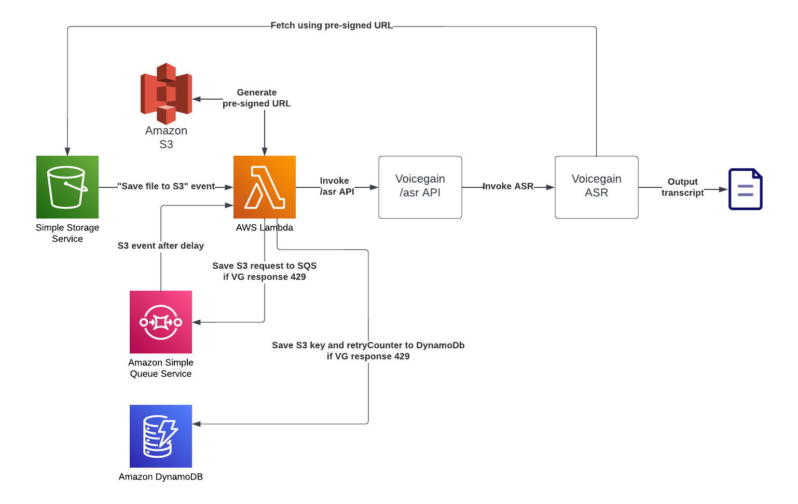
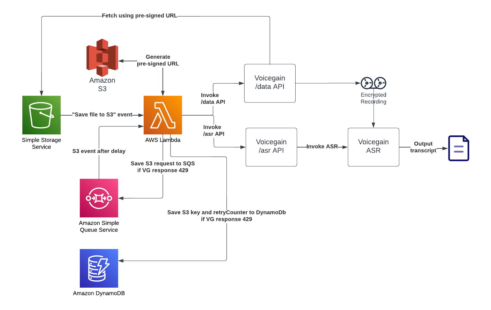

## 2 Lambda fuction versions

### Long-lived presigned S3 URL

### Short-lived presigned S3 URL

## Ways how to configure environment:
1. Use step by step instruction below
2. Use CloudFormation script, which is AWS native language to generate infrastructure.

## I. Step by step instruction:
### Step 1 - Create S3
1. Navigate to the S3 service.
2. Click **Create bucket** button.
3. Fill in the name.
4. Fill the region which will match lambda region.
5. All other fields are optional and additional, so you can leave as it is.
6. Click 'Create bucket' button.

### Step 2 - Create SQS queue
It's needed to handle 429 (rate limit hit) error from Voicegain API.
1. Navigate to SQS service.
2. Click **Create queue**.
3. Keep **Standard**.
4. Fill in the name of queue. For example _rate-limit-queue_
5. Select **Content-based deduplication**
6. Go to the bottom and click **Create queue**

### Step 3 - Create lambda function which is triggered by S3.
1. Navigate to the Lambda service.
2. Click **Create function** button.
3. Author from scratch.
4. Fill in the name and select Python 3.9 as runtime.
5. In the Permission tab expand Change default execution role.
6. Select Create a new role from AWS policy templates.
7. Fill in the name.
8. In Policy templates select Amazon **S3 object read-only permissions** AND **Amazon SQS poller permissions**.
9. Click **Create function** button.

### Step 4 - Add S3 trigger.
1. Now you are in the Lambda overview window.
2. On the Function overview click on **Add Trigger**.
3. Select source as S3.
4. Select your bucket.
5. Select **Event type** as **All object create event**.
6. Click on checkbox **I acknowledge that using the same S3 bucket for both input…**
7. Click Add.

### Step 5 - Add SQS trigger.
1. Now you are in the Lambda overview window.
2. On the Function overview click on **Add Trigger**.
3. Select source as SQS.
4. Select your queue _rate-limit-queue_.
5. Click Add.

### Step 6 - Edit lambda code.
1. Now you are back to the Lambda overview window.
2. Select **Code** tab and paste code from the GitHub repo.
3. !!Fill in all variables on the top of the lambda function code:
    - sqsUrl (open SQS overview page -> select your queue -> copy link)
    - voicegainJwt
    - myAuthConf
4. Click **Deploy**.

### View logs
1. In the Lambda overview page open **Monitor** tab.
2. Under it open **Logs** tab.
3. Click **View logs in CloudWatch**

## II. CloudFormation script deployment:

### Step 1 - Create infrastructure via CloudFormation.
1. Navigate to CloudFormation overview window.
2. Click **Create Stack** button. Select **With new resources (standard)**.
3. On **Template source** select **Upload template file**.
4. Click **Choose file** and select **cloudFormation.yaml**.
5. Click **Next** button.
6. Fill in **Stack name**. It could be any name. For example _s3-lambda-handler-stack_ .
7. Fill in **Bucket name**. It's bucket for files you want to upload in.
8. Click **Next** button. **Next** button again.
9. Click **Create stack** button.
10. Wait till stack creation process.

### Step 2 - Edit lambda code.
1. Now you are back to the Lambda overview window.
2. Select **Code** tab and paste code from the GitHub repo.
3. !Fill in all variables on the top of the lambda function code:
    - sqsUrl (open SQS overview page -> select your queue -> copy link)
    - voicegainJwt
    - myAuthConf
4. Click **Deploy**.

### View logs
1. In the Lambda overview page open **Monitor** tab.
2. Under it open **Logs** tab.
3. Click **View logs in CloudWatch**
