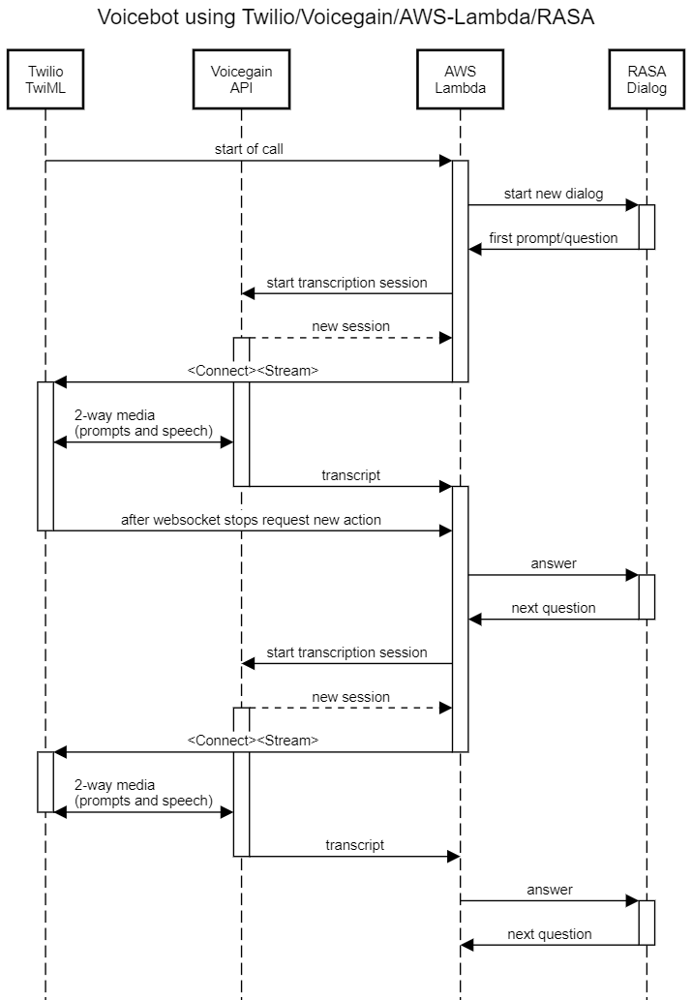

# Lambda Function Voicebot using Twilio, Voicegain, and RASA #

`twilioVoicegainRasa1.js` - Node.js AWS Lambda function that connects Twilio, Voicegain ASR API, and RASA for a functioning Voicebot over a phone. 

## What does it do ? ##

The setup allows you to call a phone number and then interact with a Voicebot that uses RASA as the dialog logic engine.

## How does it work ? ##

### The Components ###

* **[Twilio Programmable Voice](https://www.twilio.com/docs/voice)** - We configure a Twilio phone number to point to a TwiML App that has the AWS Lambda function as the callback URL.
* **[AWS Lambda function](https://aws.amazon.com/lambda/)** - a single Node.js function with an API Gateway trigger (simple HTTP API type). 
* **[Voicegain STT API](https://www.voicegain.ai/api)** - we are using /asr/transcribe/async api with input via websocket stream and output via a callback. Callback is to the same AWS Lambda function but Voicegain callback is POST while Twilio callback is GET.
* **[RASA](https://rasa.com/)** - dialog logic is provided by RASA NLU Dialog server which is accessible over [RestInput API](https://rasa.com/docs/rasa/connectors/your-own-website/#restinput). 
   * If you do not have a running RASA bot ready yet, you can use `lambda-echo-bot.py` to simulate a simple Echo Bot for testing  
* **[AWS S3](https://aws.amazon.com/s3/)** for storing the transcription results at each dialog turn

Requests to RASA look as follows:
```
{
  "sender": "test_user",  // sender ID of the user sending the message
  "message": "Hi there!"
}
```
Responses from RASA have this format:
```
[
  {"text" : "some statement"},
  {"text" : "another statement"},
  {"text" : "some question"}
]
```

### The Steps ###

The sequence diagram is provided below. Basically, the sequence of operations is as follows:
1. Call a Twilio phone number
1. Twilio makes an initial callback to the Lambda function 
1. Lambda function sends "Hi" RASA and RASA responds with the initial dialog prompt
1. Lambda function calls Voicegain to start an async transcription session. Voicegain responds with a url of a websocket for audio streaming
1. Lambda function responds to Twilio with a TwiML command `<Connect><Stream>` to open a Media Stream to Voicegain. The command will also contain the text of the question prompt. 
1. Voicegain uses TTS to generate from the text of the RASA question an audio prompt and streams it via websocket to Twilio for playback
1. The Caller hears the prompt and says something in response
1. Twilio streams caller audio to Voicegain ASR
1. Voicegain ASR transcribes the speech to text and makes a callback with the result of transcription to Lambda function
1. Lambda function stores the transcription result in S3
1. Voicegain closes the websocket session with Twilio
1. Twilio notices end of session with ASR and makes a callback to Lambda function to find out what to do next
1. Lambda function retrieves result of recognition from S3 and passes it to RASA.
1. RASA processes the answer and generates next question in the dialogue
1. We continue next turn same as in step 4.




## License ##

The MIT License

Copyright (c) Voicegain.

Permission is hereby granted, free of charge, to any person obtaining a
copy of this software and associated documentation files (the "Software"),
to deal in the Software without restriction, including without limitation
the rights to use, copy, modify, merge, publish, distribute, sublicense,
and/or sell copies of the Software, and to permit persons to whom the
Software is furnished to do so, subject to the following conditions:

The above copyright notice and this permission notice shall be included in
all copies or substantial portions of the Software.

THE SOFTWARE IS PROVIDED "AS IS", WITHOUT WARRANTY OF ANY KIND, EXPRESS
OR IMPLIED, INCLUDING BUT NOT LIMITED TO THE WARRANTIES OF MERCHANTABILITY,
FITNESS FOR A PARTICULAR PURPOSE AND NONINFRINGEMENT. IN NO EVENT SHALL
THE AUTHORS OR COPYRIGHT HOLDERS BE LIABLE FOR ANY CLAIM, DAMAGES OR OTHER
LIABILITY, WHETHER IN AN ACTION OF CONTRACT, TORT OR OTHERWISE, ARISING
FROM, OUT OF OR IN CONNECTION WITH THE SOFTWARE OR THE USE OR OTHER
DEALINGS IN THE SOFTWARE.
