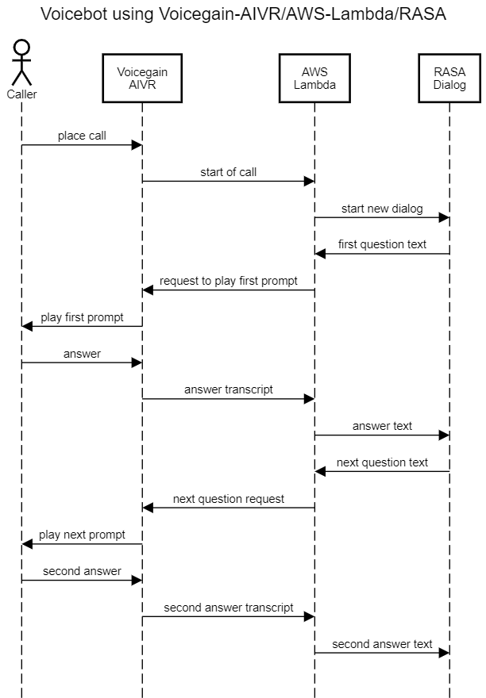
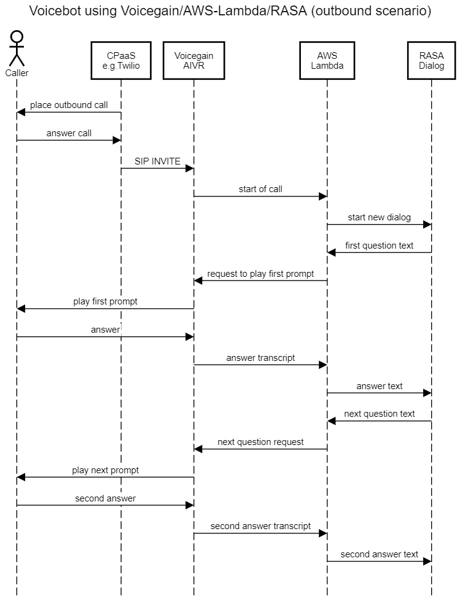

# Lambda Function Voicebot using Voicegain and RASA #

This folder contains code for a simple Voicebot built using:
* Voicegain Telephone Bot API
* AWS Lambda
* RASA

Included files:
* `voicegainIvrOne.py` - AWS Lambda function code (python version)
  * if you have a bot other than RASA you will need to modify the implementation of `make_bot_request(sender, messageForBot)` function
  * voicegainIvrOne.js - AWS Lambda function code (node.js version)
* `lambdaEchoRasa.py` - a simple lambda function that simulates an Echo RASA bot, you can point `voicegainIvrOne.py` to this function to do so some testing before integration with RASA  

Settings:
* In [Voicegain Web Console](https://console.voicegain.ai) you need to configure your Phone App to use `query` as value for `CSID Callback` - this is what the lambda function expects

## Sequence diagram
NOTE: AIVR is the Voicegain internal name for the Service on top of which the Telephone Bot API runs.

Currently Voicegain cannot make outbound calls. If you need to make outbound calls, you can use a CPaaS like e.g. Twilio to place the outbound call and then SIP INVITE Voicegain into that established call. For more see [this blog post](https://www.voicegain.ai/post/sip-invite-voicegain-from-twilio-signalwire-cpaas).   
 

## License ##

License applies to files in this folder.

The MIT License

Copyright (c) Voicegain.

Permission is hereby granted, free of charge, to any person obtaining a
copy of this software and associated documentation files (the "Software"),
to deal in the Software without restriction, including without limitation
the rights to use, copy, modify, merge, publish, distribute, sublicense,
and/or sell copies of the Software, and to permit persons to whom the
Software is furnished to do so, subject to the following conditions:

The above copyright notice and this permission notice shall be included in
all copies or substantial portions of the Software.

THE SOFTWARE IS PROVIDED "AS IS", WITHOUT WARRANTY OF ANY KIND, EXPRESS
OR IMPLIED, INCLUDING BUT NOT LIMITED TO THE WARRANTIES OF MERCHANTABILITY,
FITNESS FOR A PARTICULAR PURPOSE AND NONINFRINGEMENT. IN NO EVENT SHALL
THE AUTHORS OR COPYRIGHT HOLDERS BE LIABLE FOR ANY CLAIM, DAMAGES OR OTHER
LIABILITY, WHETHER IN AN ACTION OF CONTRACT, TORT OR OTHERWISE, ARISING
FROM, OUT OF OR IN CONNECTION WITH THE SOFTWARE OR THE USE OR OTHER
DEALINGS IN THE SOFTWARE.
