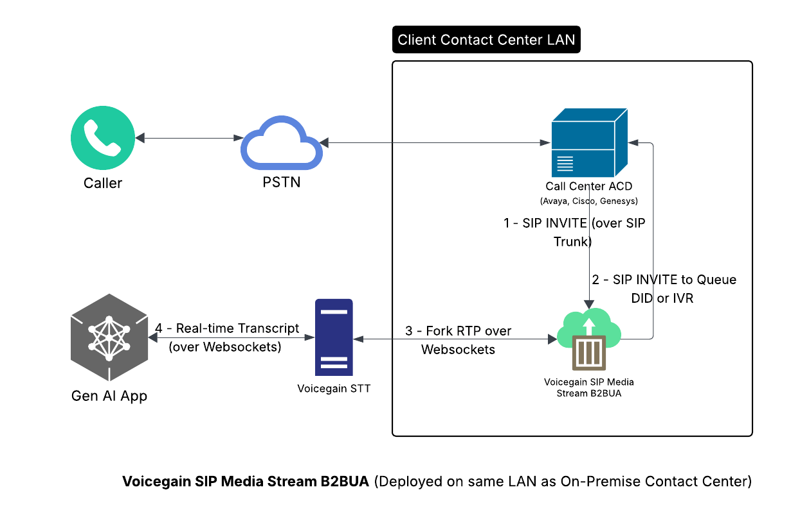

# FreeSWITCH Transcription Proxy
Proxy your SIP call via our FreeSWITCH docker and get the transcript of the call audio submitted to a websocket service.

```Steps for setting up websocket service to receive transciption results in realtime```
# 1) Install required python pacakges
Assuming you have already setup virtual enviornment(not manadatory) and installed required python packages asyncio, websockets,json and ssl. OS can be any linux distribution preferably debian 12 and above.
```sh
apt install python3.11-venv
python -m venv myenv
source myenv/bin/activate
```
# 2) Create new domain and get certficates :

(Important if you want to access your websocket service using encrypted wss:// instead of ws://)

You need to create new domain for example mydomain.com and obtain certificates using lets encrypt or other openssl and mention the paths in web service python example.
Make sure to replace mydomain.com with your domain name in sample python code.

```sh
apt install certbot
certbot certonly -d mydomain.com
```
replace these lines with your path to certs in python code
```
ssl_cert = "/etc/letsencrypt/live/mydomain.com/fullchain.pem"
ssl_key ="/etc/letsencrypt/live/mydomain.com/privkey.pem"
```
# 3) How to obtain secret key mentioned in python code

Go to and login into https://console.voicegain.ai Under API Security create Auth Configuration and select type as Bearer and enter a random string string as credential - note that it should be the same as the SECRET_KEY mentioned in python script. When call is bridged Voicegain gateway will make connection to your websocket server and it will pass this secrect key as Bearer in header request then on the websocket server side upon receving this key you should validate and proceed further. This has already been done in the python example code. 

# 4) Launch Websocket Server
```sh
python ws_server.py
```
# 5) Modify config.ini for Freeswitch docker 
A sample config.ini can be found in this repository.
```ini
# This is the SIP proxy host where you will be sending SIP traffic to
FREESWITCH_HOST_DOMAIN=fs1lab.ascalon.ai
# This is the final SIP destination domain where will be proxying to.
DESTINATION_DOMAIN=fs.ascalon.ai:5080
#this is the URI that where SIP call should be redirected in case voicegain services are down to bypass Voicegain, in this case no transcriptions results will be posted to your webserver
REDIRECT_URI=df3d29f1-856d-470d-887d-445f01541dcb@fs.ascalon.ai:5080;transport=tcp
# this main voicegain API gateway URL 
VG_GATEWAY_URL=https://api.voicegain.ai/v1/asr/transcribe/async
JWT_TOKEN=XXXXXXXXXXCcccccccyJhbGciOiJIUzx1NiIsInR5cCI6IkpXVCJ9.eyJpc3MiOiI5Y2QxN2I0NS03MzI2LTRiODEtYTQzNi1jYThlOTgxOWYyNWMiLCJhdWQiOiIqLmFzY2Fsb24uYWkiLCJzdWIixiIyZjI5Mj
# this is the Auth Configuration name that you have created in previous steps above, so the Voicegain gateway will use this name and pickup credential and auth type mentioned in the portal and make a connection to your websocket server so that you can validate it. 
AUTH_NAME=fsproxy
# This is your websocket server URL where transcription results are posted in real-time
WEBSOCKET_SERVER=wss://mydomain.com:8765
# names for the left and right channel sessions
LEFT_CHANNEL_NAME=CALLER1
RIGHT_CHANNEL_NAME=CALLER2
```
# 6) Obtain FreeSWITCH proxy docker

You will need to request from Voicegain a key vg-customer-private-ro-key.json that will give you access to Voicegain artifact repository. Run below command at linux terminal.
```sh
cat vg-customer-private-ro-key.json | sudo docker login -u _json_key --password-stdin https://us-docker.pkg.dev
```

# 7) Run FreeSWITCH docker
=======
With host networking:
```sh
-v option specifies local file path where config.ini is located this needs to be changed to where the file was copied.
```sh
docker run -d --name fsproxy --network=host -v /Path_to/config.ini:/etc/config.ini us-docker.pkg.dev/voicegain-prod/vg-customer-private/freeswitch-transcription-proxy:0.2.0
```
With bridge networking:
```sh
-v option specifies local file path where config.ini is located this needs to be changed to where the file was copied.
docker run -d --name fsproxy -p -p 5060:5060/tcp -p 5060:5060/udp -v /Path_to/config.ini:/etc/config.ini us-docker.pkg.dev/voicegain-prod/vg-customer-private/freeswitch-transcription-proxy:0.2.0
```

# 8) Prepare sip phone to make call to SIP URI

You can use, for example, [Linphone](./LINPHONE.md)

You will be making the call to the FreeSWITCH running in the docker. The SIP URI will be, for example, df3d29f1-856d-470d-887d-445f01541dcb@fs1lab.ascalon.ai;transport=tcp
where the domain will be same where the docker is running and the part before @ will be your destination on the DESTINATION_DOMAIN (from config.ini)

NOTE: if you are testing on localhost and your SIP Phone is also on localhost, make sure that the phone is not listening on port 5060 which is needed by FreeSWITCH

# 9) Testing
After setting up the application, make a call from any SIP Softphone or Linphone to URL. Once the B party answers the call, you will see live audio text messages on the ws_server.py console.

```log
(myenv) root@fs1lab:~# python ws_server.py 
Header: authorization: Bearer 12345
Authentication success
Header: sec-websocket-key: bOQ4Ybh5zWcMnvySqjyzEA==
Header: connection: upgrade
Header: sec-websocket-version: 13
Header: host: mydomain.com:8765
Header: upgrade: websocket
Path: /
Received JSON message: {'ping': 1718768962750}
EDIT->{ "ping":1718768962750 }
Header: authorization: Bearer 12345
Authentication success
Header: sec-websocket-key: EwYESS6m7fmJ8ZB3JC0MCw==
Header: connection: upgrade
Header: sec-websocket-version: 13
Header: host: mydomain.com:8765
Header: upgrade: websocket
Path: /
Received JSON message: {'ping': 1718768963017}
EDIT->{ "ping":1718768963017 }
Received JSON message: {'metadata': [{'name': 'CALLER2', 'value': 'CH2'}]}
RIGHT value: CH2
EDIT->{"metadata":[{"name":"CALLER2","value":"CH2"}]}
Received JSON message: {'utt': 'okay.', 'conf': 0.1162, 'start': 800}

	1718768966.207 CH2 	okay.
Received JSON message: {'metadata': [{'name': 'CALLER1', 'value': 'CH1'}]}
LEFT value: CH1
EDIT->{"metadata":[{"name":"CALLER1","value":"CH1"}]}
Received JSON message: {'utt': 'hell', 'conf': 0.8098, 'start': 3760}

	1718768969.700 CH1 	hell
Received JSON message: {'edit': [{'utt': 'Hello', 'conf': 0.906, 'repl': ['hell'], 'start': 3760}], 'del': 1}

	1718768969.700 CH1 	Hello
Received JSON message: {'utt': 'hi', 'conf': 0.7843, 'gap': 5420, 'start': 6460}

	1718768972.103 CH2 	hi
Received JSON message: {'utt': 'there', 'conf': 0.8673, 'gap': 320, 'start': 6860}

	1718768972.147 CH2 	hi there
Received JSON message: {'utt': 'I', 'conf': 0.9776, 'gap': 560, 'start': 7500}

	1718768973.029 CH2 	hi there I
Received JSON message: {'edit': [{'utt': "I'm", 'conf': 0.9721, 'gap': 640, 'add': True, 'start': 7580}], 'del': 1}

	1718768973.072 CH2 	hi there I'm
Received JSON message: {'utt': 'case', 'conf': 0.7993, 'gap': 80, 'start': 7900}

	1718768973.073 CH2 	hi there I'm case
Received JSON message: {'edit': [{'utt': 'Casey', 'conf': 0.9664, 'gap': 160, 'add': True, 'start': 7980}], 'del': 1}

	1718768973.991 CH2 	hi there I'm Casey
Received JSON message: {'utt': 'I', 'conf': 0.6348, 'gap': 4960, 'start': 9040}

	1718768974.639 CH1 	I
Received JSON message: {'utt': 'your', 'conf': 0.7215, 'gap': 720, 'start': 9180}

	1718768974.793 CH2 	your
Received JSON message: {'utt': 'smart', 'conf': 0.9757, 'start': 9260}

	1718768974.835 CH2 	your smart
Received JSON message: {'utt': 'assistant', 'conf': 0.9907, 'gap': 240, 'start': 9580}

	1718768974.878 CH2 	your smart assistant

```
