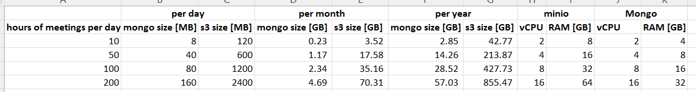

#  Setup Minio (S3 compatible) Object Store and MongoDB with reliable backup strategy
Step by step guide how to deploy Minio and Mongo Docker containers to systems (Baremetal or VM) and a recommended backup approach
----
**Prerequisites:**
* Dedicated backup storage system that can be accessed via SSH.
* Either one or two systems running Ubuntu 20.04 (You can run both Minio and Mongo containers on a single system if needed. This may work with Ubuntu 22.04 but we are using 20.04 for this guide.)

## Table of Contents
- [Step 0: Critical Storage Requirements](#before)
- [Step 1: Install Packages and initial SSH config](#step1)
- [Step 2: Minio setup and backup solution](#step2)
- [Step 3: MongoDB setup and backup solution](#step3)

## Step 0: Critical Storage Requirements

**Dedicated Remote Backup Storage Recommendation:**  
Each of the Minio and MongoDB container will have their own local dedicated storage on their respective system(s). The backup solutions in this guide aim to provide reliable application consistent backups that can resist corruption in the case of an enexpected system fault. This assumes that you have SSH access to a system that has reliable storage redundancy via some technology such as RAID or Ceph, etc...

On the remote backup storage system, you will create a directory for minio and a directory for mongodb backups. This need to be writtable by your user. The directories should be on a redundant or regularly backedup partition/disk.

For this guide we will suppose that the user: `ubuntu` has mounted backup drives to `/home/ubuntu/backups/minio` and `/home/ubuntu/backups/mongodb`

We will be using a combination of Rsync and SSHFS to transfer content and mount. As such we recommend you generate and ssh-key for authenticating on the remote storage system without a password. If your security policy allows, a passphraseless key can be used for automating the backup process. 

Generate your ssh key: `ssh-keygen` without password if permissible
Copy to the remote storage server: `ssh-copy-id ubuntu@remotestore.example.com`
Then test for connectivity by attempting to ssh into the server: `ssh ubuntu@remotestore.example.com`

Specific configuration and storage requirements for the docker systems will be addressed under their respective application below. However, you can review the following chart to determine the ideal size of the local storage volumes for each application based on your expected usage:

## Step 1: Install Packages and initial SSH config
If you are using a single system for both Minio and MongoDB then simply run all of the following commands within your terminal, otherwise, the prerequsites have been broken down into General, Minio-Specific, and MongoDB-Specific.

**General Prerequisites:**
* **NOTE:** *After running the following block of commands (ending with `usermod -aG docker ${USER}`) you must log out and log back in in order for your user to be able to run docker commands without requiring sudo.*
<pre>
sudo apt update ; sudo apt install apt-transport-https ca-certificates curl rsync software-properties-common -y && curl -fsSL https://download.docker.com/linux/ubuntu/gpg | sudo apt-key add - && sudo add-apt-repository "deb [arch=amd64] https://download.docker.com/linux/ubuntu focal stable" && sudo apt install docker-ce -y && sudo usermod -aG docker ${USER}
</pre>

**Minio System Prerequisites:**
<pre>
sudo apt update ; sudo apt install sshfs -y
curl https://dl.min.io/client/mc/release/linux-amd64/mc \
  --create-dirs \
  -o $HOME/minio-binaries/mc

chmod +x $HOME/minio-binaries/mc
export PATH=$PATH:$HOME/minio-binaries/
echo "export PATH=$PATH:$HOME/minio-binaries/" >> ~/.bashrc
</pre>

**MongoDB System Prerequisites:**
<pre>
sudo apt update ; sudo apt install lvm2 xfsprogs mongodb-clients
</pre>

## Step 2: Minio setup and backup solution

**Minio Storage Requirements**
In the case of Minio there are no special requirements. However, it is a best practice to have a dedicated partition at /data/minio to be mounted in the container. This can avoid issues with the underlying host system in the event that the disk fills. 

The following command will download the latest Minio image from docker hub and create the container, notice the following:
* `/data/minio:/data` : We are mounting the local /data/minio partition as a persistent bucket storage
* `MINIO_ACCESS_KEY=accesskey` The access key is essentially our username, change this to whatever you would prefer, but in this guide we are using 'accesskey'
* `MINIO_SECRET_KEY=secretkey` The password, essentially, and we are using the literal string: 'secretkey' in this guide

<pre>
docker run -d --restart always -p 9000:9000 -p 9001:9001 -e "MINIO_ACCESS_KEY=accesskey" -e "MINIO_SECRET_KEY=secretkey" -v /data/minio:/data -v /data/config:/root/.minio minio/minio server /data --console-address ":9001"
</pre>

We need to set a configuration for the `mc` cli, so update the accesskey and secretkey as per your own setup:
<pre>
mc alias set minio http://localhost:9000 accesskey secretkey
</pre>

### Backing up Minio:

**Mount remote storage disk via sshfs:**
  <pre>
  mkdir -p ~/ext/backups/minio
  sshfs -o reconnect,ServerAliveInterval=15,ServerAliveCountMax=3 ubuntu@remotestore.example.com:/home/ubuntu/backups/minio  ~/ext/backups/minio
  </pre>

**Backup minio to the newly mounted partition using mc mirror**
 - One time backup:
 <pre>
 mc mirror minio/ ~/ext/backups/minio/
 </pre>
 - Realtime mirror:
 <pre>
 mc mirror --watch minio/ ~/ext/backups/minio/
 </pre> 

* **NOTE:** *These commands backup every bucket within the minio instance. You can selectively choose which buckets to backup by appending them to the source: `mc mirror minio/MYFAVORITEBUCKET ~/ext/backups/minio/`.*
 

## Step 3: MongoDB setup and backup solution

**MongoDB Storage Requirements**
The Docker container for Mongodb will be mounting a local drive for storage. This partition MUST be an LVM. The underlying Volume Group must have free space. For the sake of this guide we are going take a full disk for a volumegroup and use 95% of it for our MongoDB Data. The remaining 5% will be for LVM Snapshotting which is how we achieve application consistent backups.

Lets assume we have attached a 32GB disk for our MongoDB LVM and it has appeared as /dev/sdb:

We are going to use fdisk to format the drive for LVM. Next we will create the Physical Volume (PV), Volume Group (VG), and Logical Volume (LV), finally we will create an XFS filesystem and mount our new data disk:
`sudo fdisk /dev/sdb`

Take note that we assign the Type Value of `8e`

<pre>
sudo pvcreate /dev/sdb1
sudo vgcreate vg_mongolvm /dev/sdb1
sudo lvcreate --name mongodb_data -l 95%FREE vg_mongolvm
sudo mkfs.xfs /dev/vg_mongolvm/mongodb_data
</pre>

Then add it to our /etc/fstab:
<pre>
mkdir -p ~/ext/backups/mongodb
sudo su -c "echo '/dev/mapper/vg_mongolvm-mongodb_data    /home/ubuntu/ext/backups/mongodb    xfs    defaults    0    2' >> /etc/fstab"
</pre>

Test by running: 
grep mongodb /etc/fstab && sudo mount -a && df -h | grep mongodb

### Start mongodb:
Set the username and password according to your needs:
<pre>
docker run -d --restart always -p 27017:27017 -e "MONGO_INITDB_ROOT_USERNAME=root" -e "MONGO_INITDB_ROOT_PASSWORD=changeme" -v /data/db:/data/db mongo:4.4.17-rc0
</pre>

### Backing up MongoDB:

Configure LVM to autogrow if needed to avoid snapshot corruption:
<pre>
sudo sed -i.bak 's/snapshot_autoextend_threshold = 100/snapshot_autoextend_threshold = 90/g' /etc/lvm/lvm.conf
</pre>

**Create LVM Snapshot:**
<pre>
sudo lvcreate -l 95%FREE -s -n mongosnap /dev/vg_mongolvm/mongodb_data
sudo lvs
</pre>

Create a mountpoint to stage the snapshot data, then rsync the data to our remote storage system:
<pre>

mkdir -p /home/ubuntu/local/mongosnap
sudo mount -o rw,nouuid /dev/mapper/vg_mongolvm-mongosnap /home/ubuntu/local/mongosnap
# Rsync data to remote storage system
rsync -avPz /home/ubuntu/local/mongosnap/ ubuntu@remotestore.example.com:/home/ubuntu/backups/mongodb/
# Unmount snapshot and remove it
sudo umount /home/ubuntu/local/mongosnap
sudo lvremove /dev/mongolvm/mongosnap
</pre>

