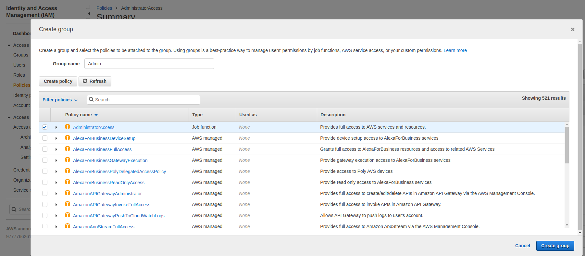
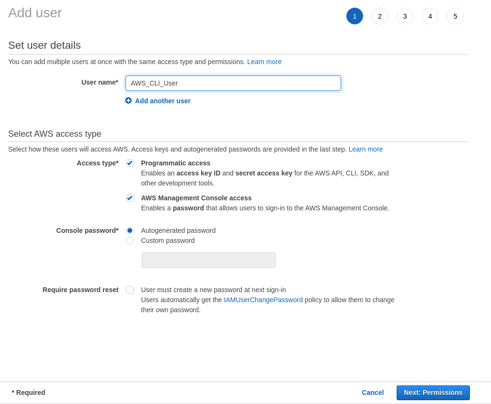
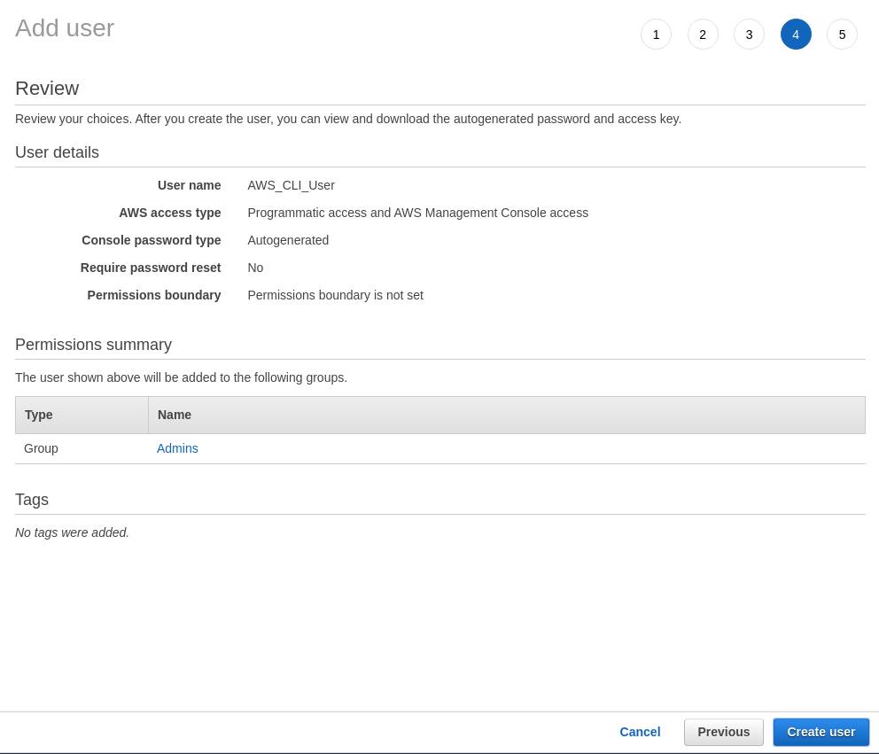
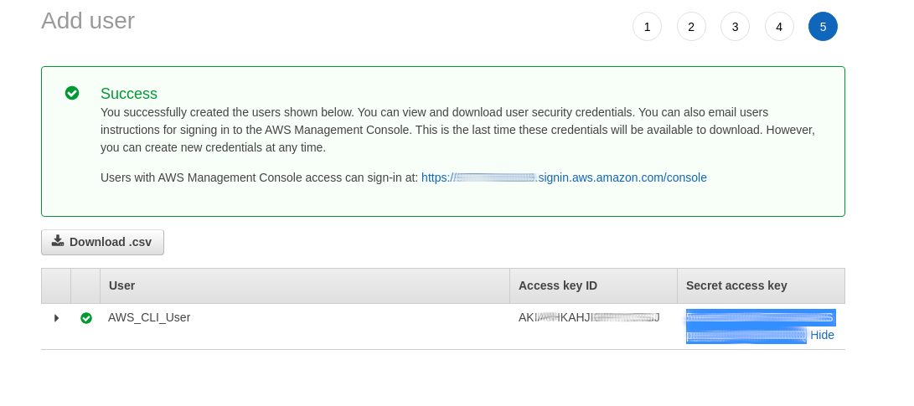
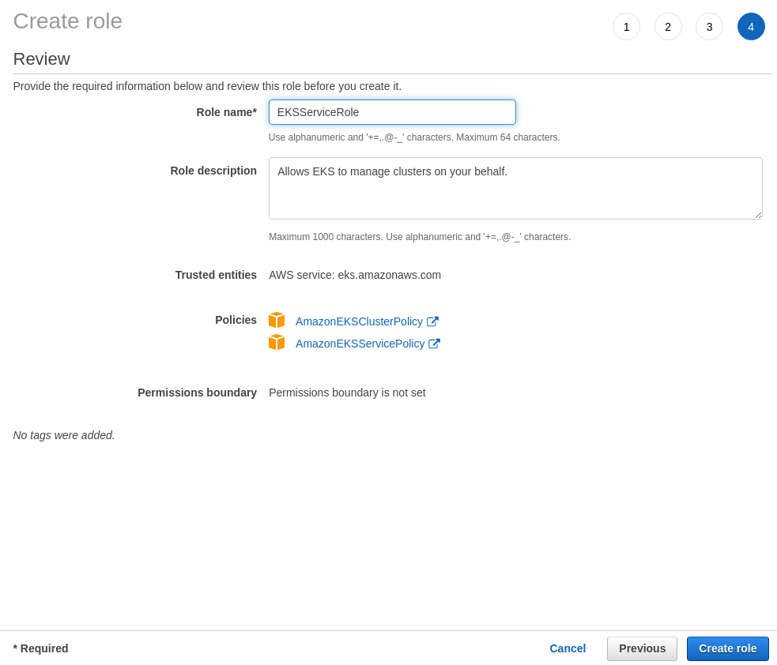
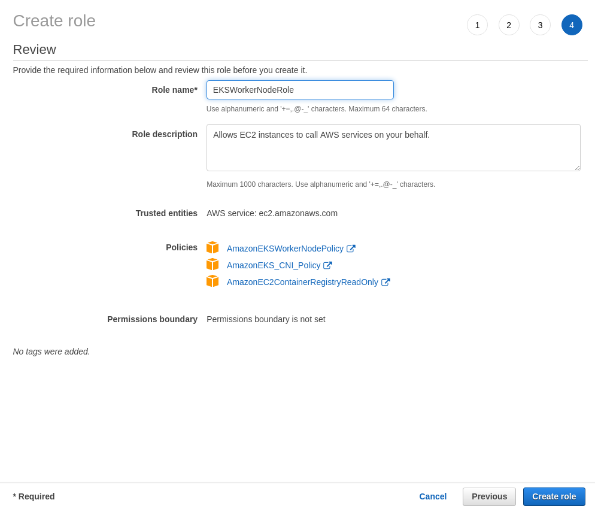
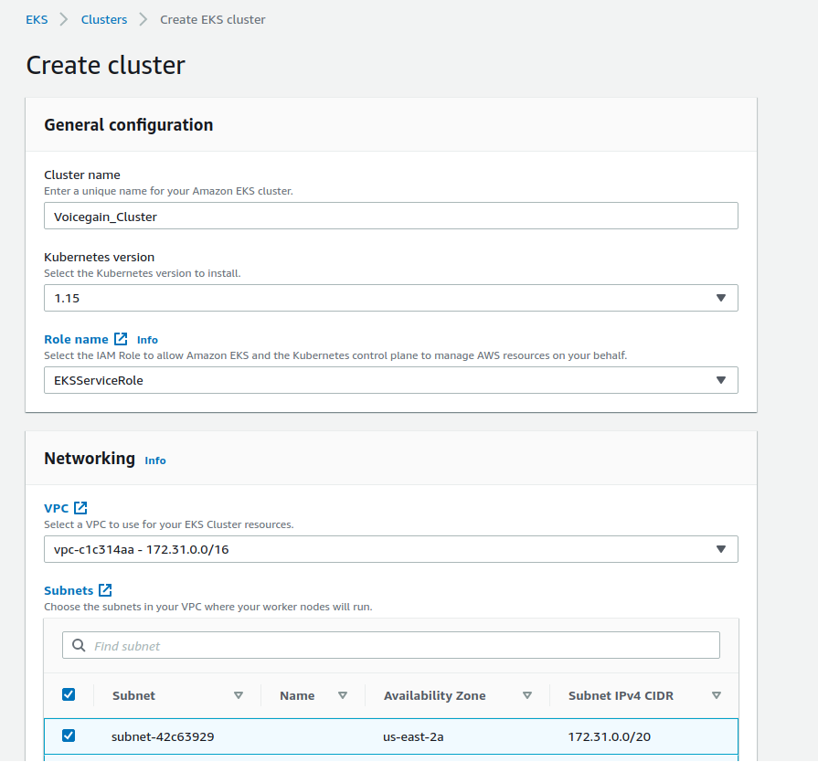
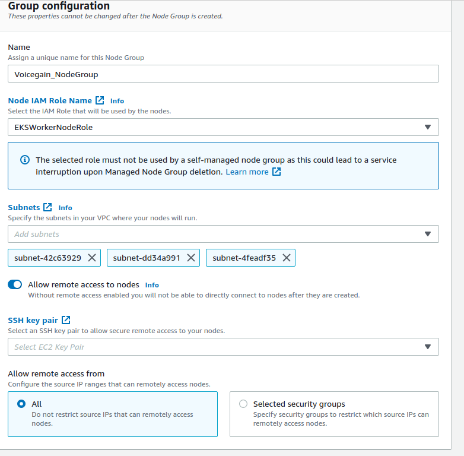
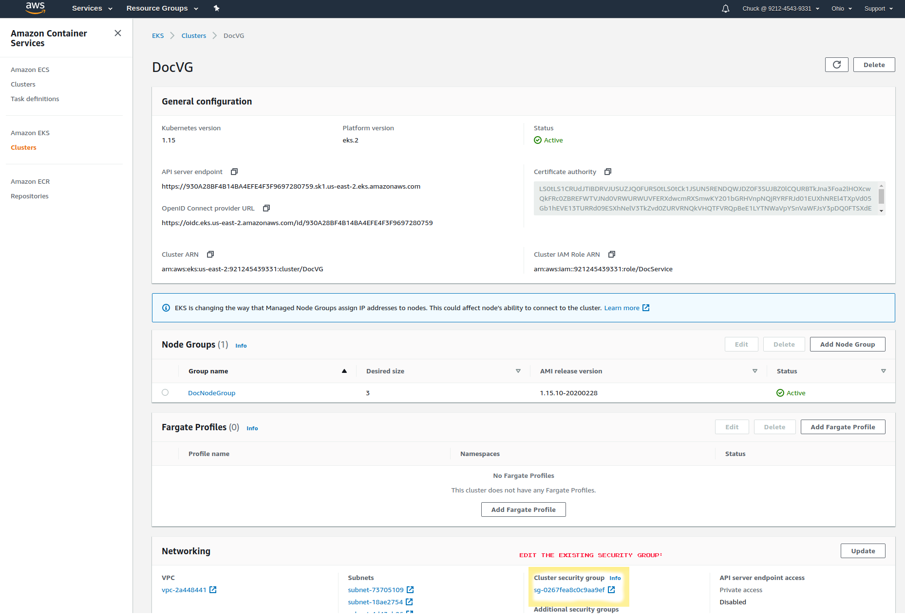
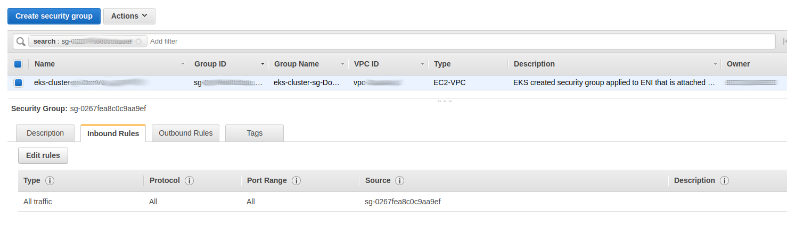

# Deploy Voicegain into AWS
Step by step guide how to deploy Voicegain Speech-to-Text Platform into AWS
----
Under the hood:
This guide will have you do the following:
* Create an AWS Kubernetes cluster with GPU’s
* Authorize Voicegain to authenticate with your cluster by editing the aws-auth configmap and uploading your kubeconfig file to the Voicegain Portal

At step 4 we describe the option of using Vacuum CLI tool. This tool is not yet publicly available. We will modify this document as soon as we make it available with instructions on how  to download it.

## Table of Contents
- [Step 1: Request GPUs from AWS](#step1)
- [Step 2: Create a User](#Step-2:-Create-a-User)
- [Step 3: Create Roles](#Step-3:-Create-Roles)
- [Step 4: Choose Between Automated or Manual K8s Setup](#Step-4:-Choose-Between-Automated-or-Manual-K8s-Setup)
- [Step 5: Create Cluster](#Step-5:-Create-Cluster)
- [Step 6: Create NodeGroup](#Step-6:-Create-NodeGroup)
- [Step 7: Install Kubectl](#Step-7:-Install-Kubectl)
- [Step 8: Install and Configure awscli](#Step-8:-Install-and-Configure-awscli)
- [Step 9: Get kubeconfig](#Step-9:-Get-kubeconfig)
- [Step 10: Give Voicegain Access to K8s](#Step-10:-Give-Voicegain-Access-to-K8s)
- [Step 11: Upload kubeconfig to Voicegain](#Step-11:-Upload-kubeconfig-to-Voicegain)
- [Step 12: Allow Access to Voicegain-Portal on AWS](#Step-12:-Allow-Access-to-Voicegain-Portal-on-AWS)
- [Step 13: Start Deployment of Chosen Features](#Step-13:-Start-Deployment-of-Chosen-Features)
- [Step 14: Wait for Deployment to Finish](#Step-14:-Wait-for-Deployment-to-Finish)
- [Step 15: Start Using Voicegain in AWS](#step15)

## <a id="step1"/>Step 1: Request GPUs from AWS

This may take a while so it is smart to do this at the very beginning

## Step 2: Create a User

Under IAM: 
* Create a user with Console Access* and Programmatic API access and save your "access key ID" and "secret access key"
* Create a password<sup>*</sup> and identify a default regions such as ‘us-east-2’ (For simplicity you can provide full AWS service/resource access by adding user to a Group with AdministratorAccess)

<sup>*</sup> NOTE: Console Access and Password creation not required for Vacuum CLI users.









## Step 3: Create Roles

### Method A

1. Create Amazon EKS worker node role in IAM console: [see AWS User Guide](https://docs.aws.amazon.com/eks/latest/userguide/worker_node_IAM_role.html)
2. Create Amazon EKS Service role in IAM console: [see AWS User Guide](https://docs.aws.amazon.com/eks/latest/userguide/service_IAM_role.html)





Caveat: The EKS Role will not appear available in Cluster Creation until you either completely refresh the page or close and renavigate to Cluster Creation. (Navigating away and back to Cluster Creation has not ever worked in all of our tests.)

Alternatively, you can create Roles using method B

### Method B

Create a role in Amazon IAM with the following 5 policies:
* [AmazonEKSClusterPolicy](https://console.aws.amazon.com/iam/home#/policies/arn:aws:iam::aws:policy/AmazonEKSClusterPolicy$jsonEditor)
* AmazonEKSServicePolicy
* [AmazonEKSWorkerNodePolicy](https://console.aws.amazon.com/iam/home#/policies/arn:aws:iam::aws:policy/AmazonEKSWorkerNodePolicy$jsonEditor)
* [AmazonEKS_CNI_Policy](https://console.aws.amazon.com/iam/home#/policies/arn:aws:iam::aws:policy/AmazonEKS_CNI_Policy$jsonEditor)
* [AmazonEC2ContainerRegistryReadOnly](https://console.aws.amazon.com/iam/home#/policies/arn:aws:iam::aws:policy/AmazonEC2ContainerRegistryReadOnly$jsonEditor)

With the following Trust Relationship:
```javascript
{
  "Version": "2020-01-01",
  "Statement": [
    {
      "Effect": "Allow",
      "Principal": {
        "Service": [
          "eks.amazonaws.com",
          "ec2.amazonaws.com"
        ]
      },
      "Action": "sts:AssumeRole"
    }
  ]
}
```

## Step 4: Choose Between Automated or Manual K8s Setup

Either:

### Provision Amazon K8S cluster using Vacuum tool

**Recommended:** Set up ‘vacuum’ tool on your administration system, you will need your AWS credentials, EKS Worker Role, and subnet IDs from AWS.

Create Edge Cluster via Voicegain Portal and retrieve ClusterID, then  
<pre>
vacuum k8s provision -t cluster_name -u Cluster_ID
</pre>

Then skip to **Step 12**

### Provision Amazon K8S cluster manually

Sign out of AWS Console and Sign In with the IAM User created in Step one. You will sign in with your Account ID, Username, and password.

Then proceed with **Step 5**

## Step 5: Create Cluster 

Create Cluster w/ EKSServiceRole:



## Step 6: Create NodeGroup

Create NodeGroup



When creating the NodeGroups, Voicegain will require GPU’s, thus choose the Amazon Linux 2 GPU Enabled (AL2_x86_64)) AMI type and a g4dn EC2 Instance Type. 
Minimum 2xlarge (32 GiB memory) w/ minimum 2 nodes.

## Step 7: Install Kubectl

Local system setup, install Kubectl following [these instructions from kubernetes website](https://kubernetes.io/docs/tasks/tools/install-kubectl/)

## Step 8: Install and Configure awscli

Install and configure awscli:

If using Python: 
<pre>
python -m pip install awscli --user
aws configure
</pre>
You can test for successful configuration with:
<pre>
aws eks list-clusters
</pre>

## Step 9: Get kubeconfig

Retreive kubernetes configuration file:
<pre>
aws eks update-kubeconfig –name YOUR_CLUSTER_NAME
</pre>
And test access with the following:  
<pre>
kubectl get nodes
</pre>

## Step 10: Give Voicegain Access to K8s

Provide Voicegain with access to the Kubernetes (k8s) cluster:

Create a file on the local system named voicegain-auth.yaml with the following content:
<pre>
data:
  mapUsers: |
    - userarn: arn:aws:iam::977776626189:user/VoicegainAgent
      username: vg_user
      groups:
        - system:masters
</pre>
And patch the aws-auth configmap with the following command:
<pre>
kubectl -n kube-system patch cm aws-auth --patch "$(< voicegain-auth.yaml )"
</pre>

## Step 11: Upload kubeconfig to Voicegain

If not using Vacuum: Install the Voicegain API access libraries (at this point please send email to support@voicegain.ai to obtain them) and use your JWT token to upload your kubeconfig file, now located at `~/.kube/confg` to our portal.

## Step 12: Allow Access to Voicegain-Portal on AWS

Allow access to Voicegain-Portal on AWS by editing the Cluster’s Security-Group (Inbound Rules):





Add a new Inbound Rule w/ Custom TCP Port 31680 and Source of “My IP” (or any IP’s you want to be able to reach your cluster management portal):


## Step 13: Start Deployment of Chosen Features

From the [Voicegain Portal](https://portal.voicegain.ai "Voicegain Cloud Portal"), choose the features you wish to utilize and submit. 

## Step 14: Wait for Deployment to Finish

You can watch the progress of your cluster deployment via:
<pre>
watch `kubectl get po`
</pre>

## <a id="step15"/>Step 15: Start Using Voicegain in AWS

Once the deployment has settled, follow the Customer-portal link on your Edge Deployment page on [portal.voicegain.ai](https://portal.voicegain.ai "Voicegain Cloud Portal") , log in, and begin transcribing! 

All done!
