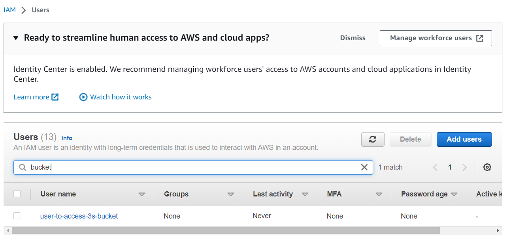

# How to create S3 bucket for use with Voicegain Edge Deployment

## Creating and S3 bucket

Once your account is setup login to your aws console https://console.aws.amazon.com and select S3 from services menu.

Click Create Bucket 

Provide bucket information - note you will need to select a globally unique name - we suggest you append your company name to the end of the bucket name, e.g. "my-s3-bucket.acme"

and

## Generating AWS Access Key ID and Secret Access Key

We will use a Key that is designated to this S3 bucket. First we need to go to IAM

### Create a policy to access the bucket

Here we will first create a policy that will give access only to the previoucly created bucket

We will define policy in JSON, of course replace `my-s3-bucket` with the name of your target S3 bucket.

<pre>
{
    "Version": "2012-10-17",
    "Statement": [
        {
            "Effect": "Allow",
            "Action": "s3:*",
            "Resource": [
                "arn:aws:s3:::my-s3-bucket",
                "arn:aws:s3:::my-s3-bucket/*"
            ]
        }
    ]
}
</pre>

On the "Review policy" page just give it a name and click Create Policy

You will see the new created policy in the Policy list

## Create a user with the policy

Now we need to create a User to which we will assign the S3 polci and the key.

In IAM, we go to Users and click Add users

We give user a name and give **no** access to AWS Console

We choose "Attach policies directly" and select the policy that we created in the previous step.

On the next page we click Create user

## Generare a key for the user

Then we go back to the User list and select our new created user (click on the user name)

On the page that opens, we click on "Create access key"

On the next page we select Other and click Next

On the next page provide a meaningful description and click "Create access key"

Now copy the key and click Done

