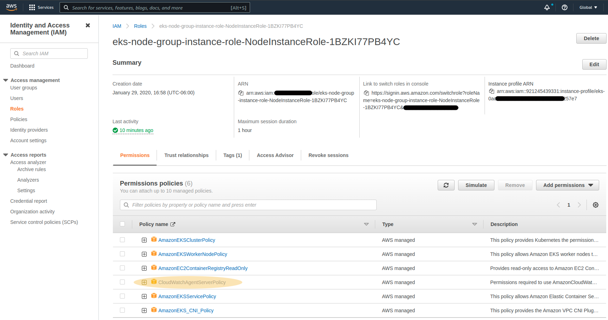
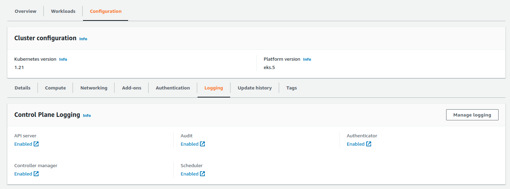
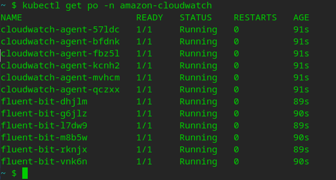

# AWS Advanced - CloudWatch Application Insights

## Table of Contents
- [Step 1: Ensure proper User Permissions](#step1)
- [Step 2: Enable CloudWatch Logging on EKS](#step2)
- [Step 3: Deploy CloudWatch Agent to k8s Cluster](#step3)

## Step 1: Ensure proper NodeGroup Role Permissions
Add CloudWatchAgentServerPolicy Permissions to your NodeGroup Role:

*If you do not know your NodeGroup Role:*
- In your AWS Console: Go to EKS and your cluster
- Choose the *Configuration* tab and the *Compute* sub-tab
- Select your NodeGroup Role

*If you do know your NodeGroup Role:*
- Select the IAM (Identity and Access Management)
- Select Role and then select your NodeGroup Role account

*Add Permission*
- Click **"Add Permissions"** 
- Select **"Attach existing policies directly"** 
- Search for CloudWatchAgentServerPolicy, then check the box and click **"Next: Review"** then complete the prompts to accept.

## Step 2: Enable CloudWatch Logging on EKS
- In your AWS Console: Go to EKS and select your Cluster
- Choose the **"Configuration"** tab
- Select the **"Logging"** sub-tab
- Click **"Manage logging"** 
- Enable and save all logging options

## Step 3: Deploy CloudWatch Agent to k8s Cluster

Log in to your EKS administrative system that has `awscli` and `kubectl` configured for your cluster

Copy the code block below and edit it for your **ClusterName** and **RegionName**

<pre>

ClusterName=YOUR_CLUSTER_NAME
RegionName=YOUR_AWS_REGION

FluentBitHttpPort='2020'
FluentBitReadFromHead='Off'
[[ ${FluentBitReadFromHead} = 'On' ]] && FluentBitReadFromTail='Off'|| FluentBitReadFromTail='On'
[[ -z ${FluentBitHttpPort} ]] && FluentBitHttpServer='Off' || FluentBitHttpServer='On'
curl https://raw.githubusercontent.com/aws-samples/amazon-cloudwatch-container-insights/latest/k8s-deployment-manifest-templates/deployment-mode/daemonset/container-insights-monitoring/quickstart/cwagent-fluent-bit-quickstart.yaml | sed 's/{{cluster_name}}/'${ClusterName}'/;s/{{region_name}}/'${RegionName}'/;s/{{http_server_toggle}}/"'${FluentBitHttpServer}'"/;s/{{http_server_port}}/"'${FluentBitHttpPort}'"/;s/{{read_from_head}}/"'${FluentBitReadFromHead}'"/;s/{{read_from_tail}}/"'${FluentBitReadFromTail}'"/' | kubectl apply -f - 
</pre>

You can ensure it deployed successfully with: 
<pre>
kubectl get po -n amazon-cloudwatch
</pre>

All done here!
---
Goto: [top of document](#top)
