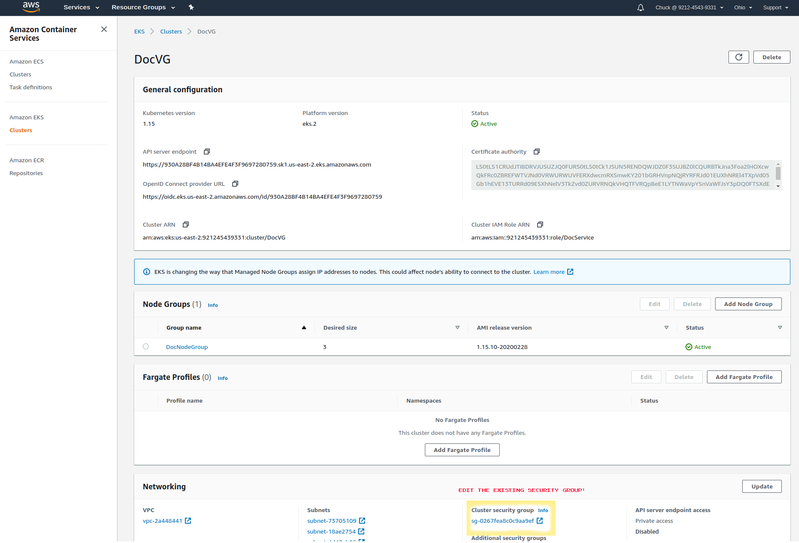
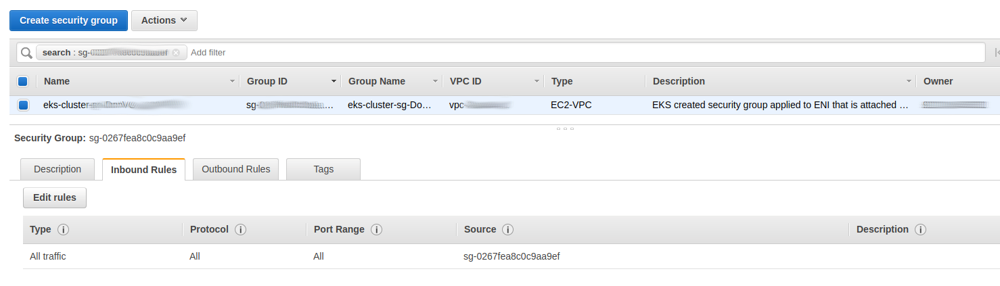

# AWS Specific Steps for creating Kubernetes cluster suitable for Voicegain deployment
Required Steps, AWS Provided documentation, and recommended best practices
----
**Overview:**
>* Create an AWS Kubernetes cluster with GPU’s and whitelist Voicegain IP's
>* Authorize Voicegain to authenticate by creating a Kubernetes Service Account

## Table of Contents
- [Step 1: Request GPUs from AWS](#step1)
- [Step 2: Create Cluster](#step2)
- [Step 3: Permit Access to your Edge Console](#step3)
- [Step 4: Install and Configure awscli](#step4)
- [Step 5: Get kubeconfig](#step5)

## Step 1: Request GPUs from AWS
In order to use GPUs you must request a Quota increase for them from AWS.

The instance types (P type, G type/ On-demand, Spot instances) that you require are dependent on your Organizations needs.  

AWS Link: [Instance Types](https://aws.amazon.com/ec2/instance-types/)

Be certain you are requesting them for the AWS Region you wish to run your cluster in.  
AWS Link: [EC2 Quota Requests](https://console.aws.amazon.com/servicequotas/home/services/ec2/quotas)

## Step 2: Create Cluster

Log into your AWS Console and go to EKS and create your cluster. This will require a Cluster Role and Node Group  
AWS Link: [AWS Current Guide for Kubernetes Cluster creation](https://docs.aws.amazon.com/eks/latest/userguide/create-cluster.html)  

AWS Link: [Creating Amazon EKS Cluster Role](https://docs.aws.amazon.com/eks/latest/userguide/service_IAM_role.html#create-service-role)  

When you reach the "Cluster endpoint access" card in Cluster Creation; it is required that the API server enpoint is Publically and Privately available, 
however it is recommended that you limit access to your Organization's access IP and Voicegain's access IP. For security purposes this IP address is avaialble upon request.  
**Please contact Voicegain to receive the required Voicegain Access IP address.**

Afterward you will need to create nodegroups for your GPU Instasnces for the cluster  
AWS Link: [Creating Amazon Node Group](https://docs.aws.amazon.com/eks/latest/userguide/create-managed-node-group.html)

## Step 3: Permit Access to your Edge Console on AWS

Allow access to Voicegain Cloud on AWS by editing the Cluster’s Security-Group (Inbound Rules):

Add a new Inbound Rule w/ Custom TCP Port 31680 and Source of “My IP” (or any IP’s you want to be able to reach your cluster management console):

## Step 4: Install and Configure kubectl and awscli
Install Kubectl

As stated in the Universal Steps guide, Kubectl is required and assumed to be running on a linux system able to reach to the K8s Cluster:  
Local system setup, install Kubectl following [these instructions from kubernetes website](https://kubernetes.io/docs/tasks/tools/install-kubectl/)

Install and configure awscli:

If using Python: 
<pre>
python -m pip install awscli --user
aws configure
</pre>
You can test for successful configuration with:
<pre>
aws eks list-clusters
</pre>

## Step 5: Get kubeconfig

Retreive kubernetes configuration file:
<pre>
aws eks update-kubeconfig --name YOUR_CLUSTER_NAME
</pre>
And test access with the following:  
<pre>
kubectl get nodes
</pre>

All done here!

[Continue with universal deployment guide Step 2](./universal-deployment-guide.md#Step2)

---
Goto: [top of document](#top)
