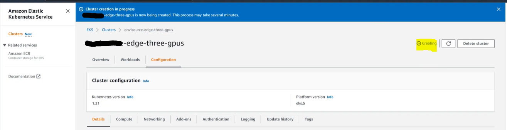
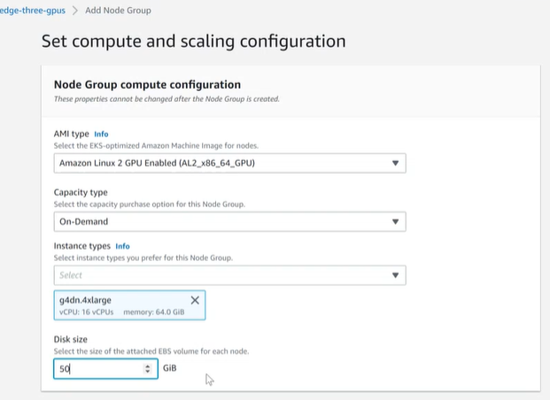
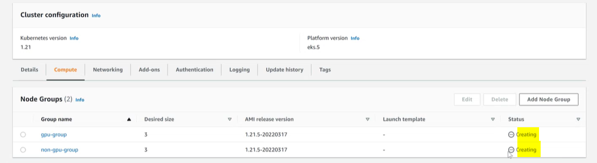

# AWS Specific Steps for creating Kubernetes cluster suitable for Voicegain deployment
Required Steps, AWS Provided documentation, and recommended best practices
----
**Overview:**
>* Create an AWS Kubernetes cluster with GPU’s and whitelist Voicegain IP's
>* Authorize Voicegain to authenticate by creating a Kubernetes Service Account

## Table of Contents
- [Step 1: Request GPUs from AWS](#step1)
- [Step 2: Create Cluster and Node Groups](#step2)
- [Step 3: Install and Configure awscli](#step3)
- [Step 4: Get kubeconfig](#step4)
- [Step 5: Continue on Voicegain Web Console](#step5)
- [Step 6: Configure LB if needed](#step6)

## Step 1: Request GPUs from AWS
In order to use GPUs you must request a Quota increase for them from AWS.

The instance types (P type, G type/ On-demand, Spot instances) that you require are dependent on your Organizations needs.  

AWS Links: 
* [Instance purchasing options](https://docs.aws.amazon.com/AWSEC2/latest/UserGuide/instance-purchasing-options.html)
* [Instance Types](https://aws.amazon.com/ec2/instance-types/)

Be certain you are requesting them for the AWS Region you wish to run your cluster in.  
AWS Link: [EC2 Quota Requests](https://console.aws.amazon.com/servicequotas/home/services/ec2/quotas)

## Step 2: Create Cluster and Node Groups

Log into your AWS Console and go to EKS.

Now create your cluster. This will require a Cluster Role and Node Group  
AWS Links: 
* [Creating Amazon EKS Cluster Role](https://docs.aws.amazon.com/eks/latest/userguide/service_IAM_role.html#create-service-role)  
* [AWS Current Guide for Kubernetes Cluster creation](https://docs.aws.amazon.com/eks/latest/userguide/create-cluster.html)  

Below are some screenshots (for generic details see the above two links).

Cluster creation

When you reach the "Cluster endpoint access" card in Cluster Creation; it is required that the API server enpoint is Publically and Privately available, 
however it is recommended that you limit access to your Organization's access IP and Voicegain's access IP. For security purposes this IP address is avaialble upon request.  
**Please contact Voicegain to receive the required Voicegain Access IP address.**

Networking add-ons can we left with the default values:

You can choose to send EKS logs to CloudWatch

On the next page we leave all values default.

The page after that is where the cluster gets created - takes about 15 minutes.

Once the cluster becomes active we can add and define Node Groups.
Node Groups define which GPU and non-GPU Compute Instances are to be used for the cluster. This is what will spin up the EC2 instances as worker nodes for your cluster.  
AWS Link: [Creating Amazon Node Group](https://docs.aws.amazon.com/eks/latest/userguide/create-managed-node-group.html)

We generally create two Node Groups: one for GPU instances and one for non-GPU instances.

On the first page of node group creation this is all we need to enter:

When creating the NodeGroup make certain that you are setting the systems to have at least 50gb disks.

Additionally, under Node Group scaling configuration; set your Minimum size, Maximum size and Desired size to the same number of nodes you've determined your organization requires. In this case we create a node group that will have exactly 3 instances:

Until we test multi-zone capable Persistent Volumes, on the next page you will need to deselect all but one zone. (This document will be updated accordingly once we have determined correct configuration where persistent volumes behave correctly in a multi-zone cluster.)

Next page is fine with the defaults so you can click the Create button at the bottom of it. 

While this node group is being created, we can proceed and create the second node group for non-GPU instances. The scaling setting for this group also needs to be 3 - 3 - 3.

For non-GPU node group we also select just one networking zone - the same that we selected for the GPU node group.

Eventually, we will have two node groups (they will not take much time to finish creating):

## Step 3: Install and Configure kubectl and awscli
### Install Kubectl

As stated in the Universal Steps guide, Kubectl is required and assumed to be running on a linux system able to reach to the K8s Cluster:  
Local system setup, install Kubectl following [these instructions from kubernetes website](https://kubernetes.io/docs/tasks/tools/install-kubectl/)

### Install and configure awscli

If using Python: 
<pre>
python -m pip install awscli --user
aws configure
</pre>
You can test for successful configuration with:
<pre>
aws eks list-clusters
</pre>

## Step 4: Get kubeconfig

Retrieve kubernetes configuration file:
<pre>
aws eks update-kubeconfig --name YOUR_CLUSTER_NAME
</pre>
And test access with the following:  
<pre>
kubectl get nodes
</pre>

All done here!

## Step 5: Continue on Voicegain Web Console 

[Continue with universal deployment guide Step 2](./universal-deployment-guide.md#Step2)

## Step 6: Configure the Load Balancer for Access to your Edge Voicegain Web Console and the Voicegain Web API on AWS

The load balancer was created during Voicegain Edge deployment

We use the EC2 Feature Load Balancer

Here is what a basic configuration of the load balancer looks like. 
If you had other load balancers, you can find the one assigned to your new Edge cluster by checking the hostname - it will be the one in the URL to access Edge Web Console.

Of the two security groups we need to configure the `elb` one:

We can edit the inbound rules on the security group, in particular here the HTTP port 80 inbound rule, you can e.g. add ACL for IPs:

---
Goto: [top of document](#top)
