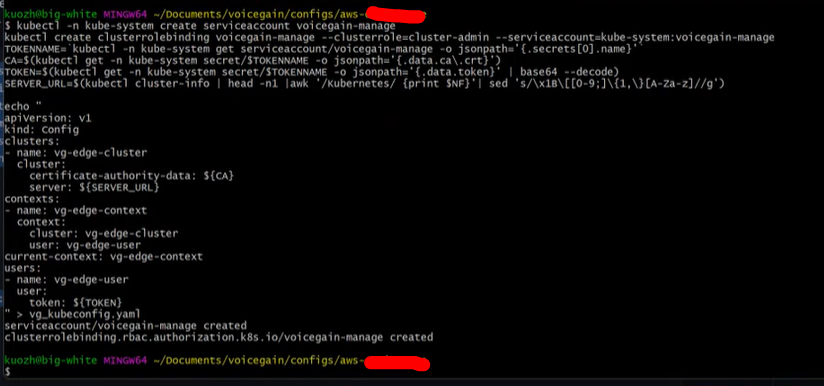
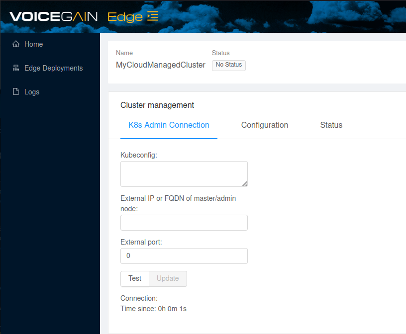
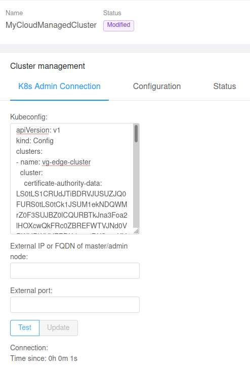
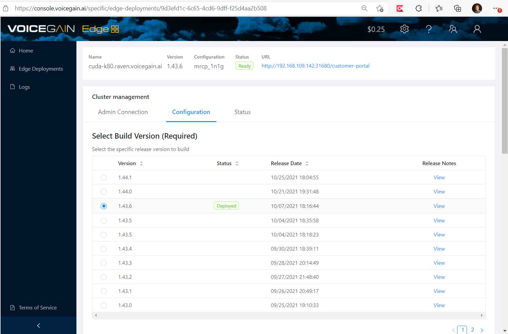
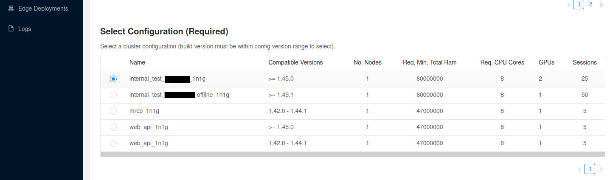

#  Deploy Voicegain to Cloud Provider Managed Kubernetes Cluster
Step by step guide how to deploy Voicegain Speech-to-Text Platform on your Cloud Managed Kubernetes Cluster (e.g. Amazon EKS or Google GKE)
----
**Overview:**
* Request GPU instances from your Cloud Provider and create a GPU enabled Kubernetes cluster.
* Create an Edge Cluster within the Voicegain Console.
* Create a Voicegain Service account on your cluster.
* Upload the Voicegain Service Account Kubernetes Config to the Voicegain Console.
* Request License deployment from Voicegain.
* Deploy the Voicegain Application to your cloud. 

## Table of Contents
- [Step 0: Before you Start](#before)
- [Step 1: Cloud Provider Specific Guides](#step1)
- [Step 2: Create Voicegain service account on your Cluster](#step2)
- [Step 3: Create Cluster on VoiceGain](#step3)
- [Step 4: Upload your Kubeconfig file to Voicegain](#step4)
- [Step 5: Deploy Voicegain Application](#step5)
- [Step 6: Monitor Deployment](#step6)
- [Step 7: Start Using Voicegain](#step7)

## Step 0: Before you Start 
**Request GPU Access from your Cloud Provider:**  
Many cloud providers, including AWS and GCP, require you to specifically request GPU quotas for your account. For new accounts, this process can take a few days to be processed so it's best to start this early. You may find more details on this process in our [Cloud Provider Specific Guides](#step1)

**Kubectl:**  
This guide will require you to interact with the kubernetes cluster using the CLI tool: `kubectl`
You will need to install kubectl on a network connected system from which you can reach your kubernetes cluster.

While kubectl is available for Windows, MacOS and Linux; this guide assumes a Linux environment is being used for specific commands when [creating the Voicegain service account](#step2)

**Voicegain Specific Steps:**  
In order to deploy Voicegain on Edge your account needs to have the Edge feature enabled - otherwise you will not see the relevant pages in the [Voicegain Web Console](https://www.voicegain.ai). Please contact support@voicegain.ai to have that enabled.

When you contact us we will ask you to describe your intended usage (e.g. offline transcription or MRCP ASR) so that we can enable an appropriate Edge configuration for your use case. We will also share recommended compute instances based on the volumes you plan to handle. If you are only exploring we can enable several generic configurations to allow you to test a variety of uses. For production use we will prepare a custom configuration that makes the best use of resources on your server(s). We shall also configure licensing based on your agreement with Voicegain. 

## Step 1: Cloud Provider Specific Guides

These guides will take you through the basics and provide resources and links do provider documentation on how to create a kubernetes cluster appropriate for our application. When you have completed creating your GPU enabled k8s cluster please proceed with [Step 2](#step2)

* [AWS Specific Steps](aws-specific-steps.md)  
* GCP: Coming Soon  
* Oracle: Coming Soon 

## Step 2: Create Voicegain service account on your Cluster
Many cloud providers take a unique approach to authenticating and interacting with your k8s cluster. In many cases this may require authentication or roles on the Cloud account level. This following step will create a kubernetes specific service account for Voicegain so to ensure a uniform experience as well on not requiring any access to your Cloud account. We will only be interacting directly with the Kubernetes API endpoint with a kubernetes cluster role.

You will want to copy and paste the entire code block below into the terminal of your linux system that has kubectl configued and connected to your new cluster as outlined in our Cloud Specific Guides:. 
<pre>
kubectl -n kube-system create serviceaccount voicegain-manage
kubectl create clusterrolebinding voicegain-manage --clusterrole=cluster-admin --serviceaccount=kube-system:voicegain-manage
TOKENNAME=`kubectl -n kube-system get serviceaccount/voicegain-manage -o jsonpath='{.secrets[0].name}'`
CA=$(kubectl get -n kube-system secret/$TOKENNAME -o jsonpath='{.data.ca\.crt}')
TOKEN=$(kubectl get -n kube-system secret/$TOKENNAME -o jsonpath='{.data.token}' | base64 --decode)
SERVER_URL=$(kubectl cluster-info | head -n1 |awk '/Kubernetes/ {print $NF}'| sed 's/\x1B\[[0-9;]\{1,\}[A-Za-z]//g')

echo "
apiVersion: v1
kind: Config
clusters:
- name: vg-edge-cluster
  cluster:
    certificate-authority-data: ${CA}
    server: ${SERVER_URL}
contexts:
- name: vg-edge-context
  context:
    cluster: vg-edge-cluster
    user: vg-edge-user
current-context: vg-edge-context
users:
- name: vg-edge-user
  user:
    token: ${TOKEN}
" > vg_kubeconfig.yaml
</pre>

In addition to creating the role this has also created a kubeconfig file for the vg-edge-user account. The contents of this `vg_kubeconfig.yaml` file will be uploaded in a later step.

## Step 3: Create Cluster on VoiceGain

1. Go to: https://console.voicegain.ai
2. If you do not have a developer account, you would need to sign up first. Detailed instructions are provided [here](https://www.voicegain.ai/post/how-to-signup-for-a-developer-account-and-start-using-voicegain-voice-ai).
3. Log in to the console and go to the "[Edge Deployment](https://console.voicegain.ai/specific/edge-deployments)" view. Click "**+ ADD**" and name your Cluster and choose **User-configured Kubernetes cluster**.

3. Find your newly created cluster in the Edge Deployment list and Load it by clicking the button to the right of the entry (left of the Delete/Trash button) 

## Step 4: Upload your Kubeconfig file to Voicegain
On the Cluster management page there are three fields you can populate. We are going to paste the entire contents of the `vg_kubeconfig.yaml` file created in the previous step into the **Kubeconfig** field.

**IMPORTANT NOTE ON CURRENT CONSOLE FUNCTION:**
At the time of this writing you will see the *External port:* field is autopopulated with the number 0. You will need to manually delete this in order to upload the configuration. Delete `0` then click *Test*, then *Update*

After Update you will see the values of the Externale IP/FQDN and port populated.

Click Test and wait until it shows `Connection: SUCCESS`. You may have to refresh the page several times and wait several minutes (3 to 5 minutes).

**>> ONCE UPLOADED: Contact Voicegain (support@voicegain.ai) to issue your license to the cluster <<**

### Note about FQDN Value

You need to provide FQDN value only if you have assigned a hostname (either directly or via a proxy) to the IP that will be used to access the Voicegain Web Console/API on the cluster. 

## Step 5: Deploy Voicegain Application
Once you have received confirmation that your license has been updated (see [Step 4](#step4)) you are ready to deploy the Voicegain application to your cluster.

From the [Voicegain Console](https://console.voicegain.ai "Voicegain Cloud Console") Load the Edge Cluster and under Cluster management select the Configuration tab.  

Next, choose the build version:  

Then, select the configuration:  
  

And to deploy: press `(Re)Build Cluster` button at the bottom of the page. 

## Step 6: Monitor Deployment

You can watch the progress of your cluster deployment on your kubectl system via:
<pre>
watch `kubectl get po`
</pre>

When you see the rex-0 pods in a Running state you can refresh your Voicegain Console session to see if your Edge Deployment is in a `Ready` state.
## Step 7: Start Using Voicegain
Once the deployment has settled, follow the Customer-console link on your Edge Deployment page on [console.voicegain.ai](https://console.voicegain.ai "Voicegain Cloud Console") , log in, and begin transcribing! 

### All done. Congratulations!

---

Goto: [top of document](#top)
