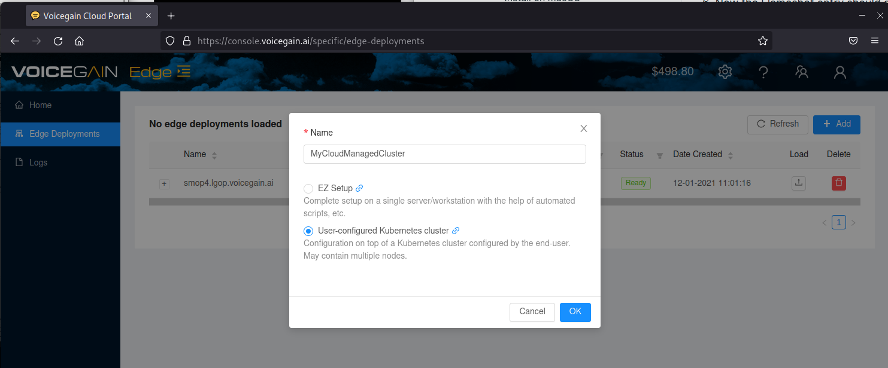

#  WIP DRAFT: In Progess. Do not Refer to this as a guide.
#  Deploy Voicegain to Cloud Provider Managed Kubernetes Cluster
Step by step guide how to deploy Voicegain Speech-to-Text Platform on your Cloud Managed Kubernetes Cluster
----
**Overview:**
* Request GPU instances from your Cloud Provider and create a GPU enabled Kubernetes cluster.
* Create an Edge Cluster within the Voicegain Console.
* Create a Voicegain Service account on your cluster.
* Upload the Voicegain Service Account Kubernetes Config to the Voicegain Console.
* Request License deployment from Voicegain.
* Deploy the Voicegain Application to your cloud. 

## Table of Contents
- [Step 0: Before you Start](#before)
- [Step 1: Cloud Provider Specific Guides](#step1)
- [Step 2: Install Kubectl and create Voicegain service account on your Cluster](#step2)
- [Step 3: Create Cluster on VoiceGain](#step3)
- [Step 4: Upload your Kubeconfig file to Voicegain](#step4)
- [Step 5: Deploy Voicegain Application](#step5)
- [Step 6: Reboots, Notes and Caveats](#step6)
- [Billing and Licensing](#license)

## Before you Start 
**Request GPU Access from your Cloud Provider:**  
Many cloud providers, including AWS and GCP, require you to specifically request GPUs for your account. This process can take a few days to be processed so it's best to start this early. You may find more details on this process in our [Cloud Provider Specific Guides](#step1)

**Kubectl:**  
During this process you will need to interact with the kubernetes cluster using the CLI tool: kubectl
You will need to install kubectl on a network connected system.
While kubectl is available for Windows, MacOS and Linux; this guide assumes a Linux environment is being used for specific commands when [creating the Voicegain service account](#Step2)

**Voicegain Specific Steps:**  
In order to deploy Voicegain on Edge your account needs to have the Edge feature enabled - otherwise you will not see the relevant pages in the [Voicegain Web Console](https://www.voicegain.ai). Please contact support@voicegain.ai to have that enabled.

When you contact us we will ask you to describe your intended usage (e.g. offline transcription or MRCP ASR) so that we can enable an appropriate Edge configuration for your use case. If you are only exploring we can enable several generic configurations to allow you to test a variety of uses. For production use we will prepare a custom configuration that makes the best use of resources on your server(s). We will also configure port based licensing if desired (default is usage-based billing). 

## Step 1: Cloud Provider Specific Guides

These guides will take you through the basics and provide resources and links do provider documentation on how to create a kubernetes cluster appropriate for our application. When you have completed creating your GPU enabled k8s cluster please proceed with [Step 2](#step2)

[AWS Specific Steps](aws-specific-steps.md)  
GCP: Coming Soon  
Oracle: Coming Soon 

## Step 2: Install kubectl and create Voicegain service account on your Cluster
The following assumes you have a linux system in which you would like to 

<pre>
kubectl -n kube-system create serviceaccount voicegain-manage
kubectl create clusterrolebinding voicegain-manage --clusterrole=cluster-admin --serviceaccount=kube-system:voicegain-manage
TOKENNAME=`kubectl -n kube-system get serviceaccount/voicegain-manage -o jsonpath='{.secrets[0].name}'`
CA=$(kubectl get -n kube-system secret/$TOKENNAME -o jsonpath='{.data.ca\.crt}')
TOKEN=$(kubectl get -n kube-system secret/$TOKENNAME -o jsonpath='{.data.token}' | base64 --decode)
SERVER_URL=$(kubectl cluster-info | head -n1 |awk '/Kubernetes/ {print $NF}'| sed 's/\x1B\[[0-9;]\{1,\}[A-Za-z]//g')

echo "
apiVersion: v1
kind: Config
clusters:
- name: vg-edge-cluster
  cluster:
    certificate-authority-data: ${CA}
    server: ${SERVER_URL}
contexts:
- name: vg-edge-context
  context:
    cluster: vg-edge-cluster
    user: vg-edge-user
current-context: vg-edge-context
users:
- name: vg-edge-user
  user:
    token: ${TOKEN}
" > vg_kubeconfig.yaml
</pre>

## Step 4: Create Cluster on VoiceGain

1. Go to: https://console.voicegain.ai
2. If you do not have a developer account, you would need to sign up first. Detailed instructions are provided [here](https://www.voicegain.ai/post/how-to-signup-for-a-developer-account-and-start-using-voicegain-voice-ai).
3. Log in to the console and go to the "[Edge Deployment](https://console.voicegain.ai/specific/edge-deployments)" view. Click "**+ ADD**" and name your Cluster and choose **User-configured Kubernetes cluster**.

3. Find your newly created cluster in the Edge Deployment list and Load it by clicking the button to the right of the entry (left of the Delete/Trash button) 

4. 
5. 
6. 
7. Create Cluster on VoiceGain
> **System Provisioning Considerations:** For the sake of simplicity; the remainder of this guide will assume we are solely using the Ubuntu system we have just installed to complete all the remaining steps. However, it is entirely possible to complete this remotely. To do this, you would open a terminal and run `sudo apt install openssh-server -y`. You can, then, create the Cluster on the Voicegain portal from the system of your choosing and paste the EZInitCommand to the Ubuntu system over ssh.

1. On your new Ubuntu system: open Firefox and go to: https://console.voicegain.ai
2. If you do not have a developer account, you would need to sign up first. Detailed instructions are provided [here](https://www.voicegain.ai/post/how-to-signup-for-a-developer-account-and-start-using-voicegain-voice-ai).
3. Log in to the console and go to the "[Edge Deployment](https://console.voicegain.ai/specific/edge-deployments)" view. Click "**+ ADD**" and name your Cluster and choose **EZ Setup**.

3. Find your newly created cluster in the Edge Deployment list and Load it by clicking the button to the right of the entry (left of the Delete/Trash button) 

## Step 10: Ensure Cluster is Functional
Once rebooted, log in and open a terminal session and run the following commands: 

`kubectl cluster-info`

It should provide endpoints and confirmation that Kubernetes master and KubeDNS are both running.

`kubectl get po`

At the time of this writing we are using nfs-client-provisioner as our default storage class provider. So you should see a single pod in the Running state.

`watch kubectl get po`

And leave this session open and running, this will allow us to monitor the progress of the deployment in the following step

### All done!

---

## Billing and Licensing

By default the Edge Setup will be deployed with usage based biling (per minute of the API time).

If you would rather be billed per port please contact us to setup a per port license for you Edge cluster.

All that we need is your account id, the name of the cluster that you would like to apply the license to (see image below), and of course the number of ports you would like to license.

Goto: [top of document](#top)
