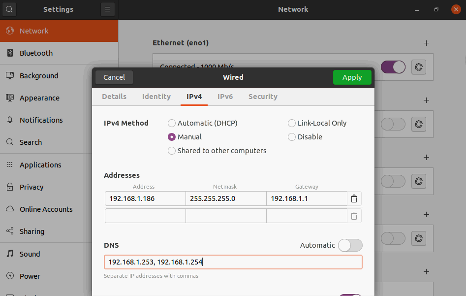
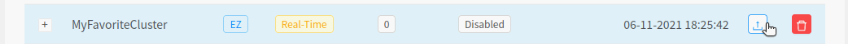

# Deploy Voicegain On-Edge
Step by step guide how to deploy Voicegain Speech-to-Text Platform on your own Hardware
----
Under the hood:
This guide will have you do the following:
* Configure your server to UEFI boot
* Install Ubuntu LTS 20.04 with custom Partitioning onto a server with NVIDIA CUDA Capable GPUs
* Provision your server using the Voicegain EZ Init script.
* Deploy the Voicegain Application to your environment. 

TODO: Manual provisioning requirements and steps to upload your preexisting kubeconfig file to the Voicegain Portal

## Table of Contents
- [Step 1: Configure your server for UEFI Boot](#step1)
- [Step 2: Boot to Installation Media](#step2)
- [Step 3: Configure Network](#step3)
- [Step 4: Configure Installation](#step4)
- [Step 5: Manually Create Partitions](#step5)
- [Step 6: Finalize Provisioning](#step6)
- [Step 7: Create Cluster on VoiceGain](#step7)
- [Step 8: Run EZInit Script](#step8)
- [Step 9: Reboot](#step9)
- [Step 10: Ensure Cluster is functional](#step10)
- [Step 11: Deploy Voicegain Application](#step11)

## Step 1: Configure your server for UEFI Boot 

Boot your server and enter BIOS Configuration Menu: [Common Manufacturer BIOS Keys](https://www.tomshardware.com/reviews/bios-keys-to-access-your-firmware,5732.html#:~:text=BIOS%20Keys%20by%20Manufacturer%201%20ASRock%3A%20F2%20or,Lenovo%20%28ThinkPads%29%3A%20Enter%20then%20F1.%20More%20items...%20)

You will want to find the Boot Settings section of your BIOS and select UEFI rather than BIOS/Legacy.

Example of DELL UEFI Mode Selection:

## Step 2: Boot to Installation Media

If you have not already; you can download the Ubuntu 20 LTS Desktop Image [here](https://ubuntu.com/download/desktop).

You can burn the installation image on to DVD, however, we recommend creating a Bootable USB drive as it is faster and becoming the new standard.

Steps to creating a bootable Ubuntu USB Drive based on your current OS:

[Ubuntu](https://ubuntu.com/tutorials/create-a-usb-stick-on-ubuntu)

[Windows](https://ubuntu.com/tutorials/create-a-usb-stick-on-windows)

[MacOS](https://ubuntu.com/tutorials/create-a-usb-stick-on-macos)

[Generic Overall Guide](https://linuxhint.com/create_bootable_linux_usb_flash_drive/)

Insert the USB drive and ensure that your system will either prioritize USB Drive in the boot order, or otherwise, manually enter the UEFI One Time Boot Menu and boot from the USB Drive. 

When the Live Ubuntu system has booted select "Try Ubuntu" (NOT "Install Ubuntu")

## Step 3: Configure Network

The reason for choosing to "Try Ubuntu" is that you can manually configure your network settings before Installing. This saves a lot of time and heartbreak. 

Selecting the network icon in the top right you can then choose to edit the wired settings, click the gear icon and select the IPV4 tab and provide the static IP address of your new server and relevant network information.

Now you can toggle the Wired Network off and then back on for the new settings to take effect. 

Next, DoubleClick the "Install Ubuntu 20.xx.x LTS" icon on the desktop. 

## Step 4: Configure Installation

Choose your language/keyboard etc...

On the "Updates and Other Software" screen, select "Minimal Installation" and "Download updates while installing Ubuntu" and ensure that all other boxes are NOT checked (Third Party software). See Below:

Then proceed with [Step 5](#step5)

## Step 5: Manually Create Partitions

In short, the spirit behind the partitions are as such: 
- EFI partition: Required 
- No Swap: Kubernetes requires swap to be off so no need to waste disk space here.
- Partition for NFS-Server: dynamically provisioned storage consumed by the k8s cluster.
 
Kubernetes doesn't support Swap, and the Storage should not impact the host system if it's ever filled. Detailed walk-through follows:

### Installation Type:
* On the "Installation Type" screen: Choose "Something else" and then "Continue"

### Partition Layout: 

* **NOTE:** *If this disk has previous partitions you will want to select the drive itself (usually /dev/sda) and then select "New Partition Table..." this WILL destroy all data previously on the disk.*

#### Allotment:

**Recommendation:** *We recommend using at least 250 GB for the / (root) partition and 750 GB (at least) for the storage partition `/nfs`. In the below example we are using a single 1TB Drive*

* **For Each Partition we create do the following:** Click on "**free space**" which should be the entire disk, and click on the "**+**" below to create your new partitions. 
The partitions will use the ext4 filesystem, and default settings such as "Primary" and their Location.

* Create a 535 MB Partition on your boot drive and chose "EFI System Partition" from the "Use as:" dropdown box.

* Create a partition of 250,000MB keep the default radio button options and choose `/` (root) as the *Mount point*.

* For the remaining ~750GB (or however much you have left over), create a new partition and manually type the *Mount point* as: `/nfs`  
**NOTE:** *Obviously this could also be done with multiple drives. Dedicating a device to `/` and another solely to `/nfs`. Another option would be to combine multiple partitions/disks into a single LVM for `/nfs`*

* **NOTE:** If this disk has previous partitions as discussed above be certain that the check boxes to *"format"* the partitions is checked for `/` and `nfs`.

Click **Install Now** -> Continue -> Continue and finish the remainder of the install (create user and password. Assign hostname, etc...). Choose to require password to log in, and restart the system when prompted (remove installation media or otherwise ensure that the boot drive is higher in the boot order).

## Step 6: Finalize Provisioning

Your first boot into Ubuntu will prompt you to set up some features: Connecting online accounts, Livepatch and Help Ubuntu. Skip these steps or approve the default choices. (Naturally, you can choose to not send any data to Canonical)

You will likely also be prompted by the "Software Updater" to, well, update. Close out of this **without** updating. The packages will be updated during the cluster provisioning phase via our EZInitScript.

## Step 7: Create Cluster on VoiceGain
> **System Provisioning Considerations:** For the sake of simplicity; the remainder of this guide will assume we are solely using the Ubuntu system we have just installed to complete all the remaining steps. However, it is entirely possible to complete this remotely. To do this, you would open a terminal and run `sudo apt install openssh-server -y`. You can, then, create the Cluster on the Voicegain portal from the system of your choosing and paste the EZInitCommand to the Ubuntu system over ssh.

1. On your new Ubuntu system: open Firefox and go to: http://console.voicegain.ai
2. Log in to the console and go to the "[Edge Deployment](https://console.voicegain.ai/specific/edge-deployments)" view. Click "**+ ADD**" and name your Cluster and choose **EZ Setup**.

3. Find your newly created cluster in the Edge Deployment list and Load it by clicking the button to the right of the entry (left of the Delete/Trash button) 

4. Define the Connection parameters relevant to your circumstance. Ideally your Edge Deployment will be in your DMZ or "Edge" and, as such, is reachable from the internet. If so, choose the top radio button: "Reachable from internet" and provide the IP Address or Fully Qualified Domain Name as well as the K8S API port (by default this is 6443). Alternatively, if you do not have a DMZ or the ability to add a pinhole in your firewall; you should choose: "Set up control tunnel". Then Click "**Apply**" and "**> Next**"
> **What is the control tunnel?:** In order to connect to systems behind a strict Firewall your Edge system will leverage autossh to establish an SSH tunnel with our network over the HTTPS (port 443) protocol. This is a non interactive shell session that solely creates a reverse port forward so that we can reach your Kubernetes API from within our network.

5. Click "**Generate**" and then "**Copy**". You now have the Command script in your clipboard. 

## Step 8: Run EZInit Script
Paste the copied Command Script into a terminal session on the Edge System, hit enter and provide your password for sudo when prompted. 

The script will perform a system update and ensure that the supported Nvidia Drivers are installed then prompt you to Press any key to continue with the provisioning process.

## Step 9: Reboot

### The details: 
#### Why Reboot?
We are rebooting in order to ensure the Nvidia drivers are loaded into the kernel. This can be done manually, however, this is not always reliable as changes are made in future updates, and if you are logged in to the graphical interface this is even more complicated.

#### Single-Node Cluster
If this is a single node cluster, press any key when prompted to reboot (ignore MultiNodeEZWokerScript command).

#### Multi-Node Cluster
IF you are setting up a multi-node cluster DO NOT YET REBOOT...

The scope of this guide is focused on simple single node clusters, however, if you wish to have a mutli node cluster: 
- Follow steps 1 through 6 of this guide on the next system. 
- Copy the `MultiNodeEZWokerScript` command provided at the end of the EZInit script on the previous node.
- SSH into the next node and paste the copied command. 
- The output of each script will provide the command for the following node and prompt for a reboot. Do not reboot until the final node is provisioned. 
- Continue this process until you've provisioned your final node. Once the final node has been provisioned you can reboot all the nodes.

TLDR:
Install Ubuntu. Run EZInitScript. Run subsequent MultiNodeEZWorkerScript(s). Then Finally: Press any key in the terminal session of each node to Reboot. 

## Step 10: Ensure Cluster is Functional
Once rebooted, log in and open a terminal session and run the following commands: 

`kubectl cluster-info`

It should provide endpoints and confirmation that Kubernetes master and KubeDNS are both running.

`kubectl get po`

At the time of this writing we are using nfs-client-provisioner as our default storage class provider. So you should see a single pod in the Running state.

`watch kubectl get po`

And leave this session open and running, this will allow us to monitor the progress of the deployment in the following step

## Step 11: Deploy Voicegain Application
Repeat the process in [Step 7](#step7) to load your Cluster in the Voicegain Console

- Click on the Configuration Tab
- Select one of the available Cluster Configurations (only ones compatible with you K8S cluster will be shown).
  - If you do not see a suitable configuration among the available choices please contact Voicegain support. 
- Under Acoustic Models select if you would like to use real-time or offline models. If this is a single GPU system you can only choose one. 
  - If you are going to use only the MRCP interface then select a real-time model.
- (Ignore the external Storage settings. This applies to custom large configurations only.)
- Choose to Save to begin the deployment

- Monitor the progress on the terminal session we created in step 10.
- Check the status on the Console to see when the deployment is finished, then you can click the link to open your local portal.

- Choose "Log In(Cloud)" and use your Voicegain credentials

- Now you can test your new deployment. 
  - If you chose an off-line acoustic model you can test by uploading a file for transcription.
  - Currently, you cannot test real-time model from the UI. A way to do this will be provided in then next release.

### All done!

---

Goto: [top of document](#top)
