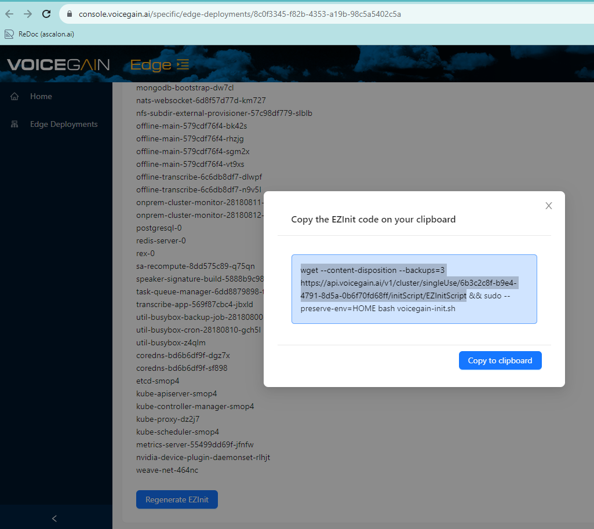

# Rollback

Rollback is easy and can be done from the Cloud Web Console. Simply choose one of the prior versions, verify that it is compatible with your configurartion, and click Rebuild (scroll down to the Rebuild button).


# Restore from Backup
Here is how you restore the backups for Mongo and Minio.

We assume that they are stored in `/backup/mongo/{epoch time}` and `/backup/minio` folders respectively.

Minio has a single backup folder with subfolders for the buckets, while Mongo has a separate each time a backup is taken.

Before restoring backups make sure there is no user/api traffic to the Edge system.

Here is a script that will restore the backups (make sure you set the correct value of this source folder `/backup/mongo/{epoch time}`):

```
export PATH=$PATH:$HOME/minio-binaries/
which mc

minio=$(kubectl get ep | awk '/9000/ {print $2}')
echo $minio
mc alias set -q --insecure minio https://${minio} accesskey secretkey                                               
mc ls --insecure minio

# Restore minio. Run without --dry-run after checking:
mc mirror --insecure /backup/minio/ minio/ --dry-run

mongo=$(\ls -lart /nfs | awk '/default-ascalon-base-mongodb/ {print $NF}'| tail -n1)
# Restore mongo. Run without --dry-run after checking:
sudo rsync -avP /backup/mongo/{epoch time} /nfs/${mongo}/ --dry-run
```

Once the script completes you will need to Rebuild the Edge cluster from the Cloud Web Console.

# Reinstall and Restore from backup

First we need to either:
* Create a new Edge Cluster - see [Deploy Voicegain on hardware or a VM](../edge-on-hardware/Edge_Deploy.md)
  * We assume that you will have the needed Mongo and Minio backuos stored somewhere safe  
* Reset an existing Edge Cluster - here are the steps:
  *   Do a kubeadm reser `sudo kubeadm reset`
  *   Delete old /nfs/default-* directories if you do not care about any of the old data
  *   From the bottom of the Edge Cluster status page get the EZInit script by clicking the Regenerate EZInit button. Note that you will need only the highlighted part of the command line script. 
  *   After you download the script we need to make a change to it `sed -i.bak ':a;N;$!ba;s/clusterExist/#clusterExist/2' voicegain-init.sh`
  *   Then stop the heart beat that pings the Cloud `sudo rm -rfv /opt/voicegain/bin/tunnel_heartbeat`
  *   And finally run the EZInit script `sudo --preserve-env=HOME bash voicegain-init.sh`
  *   Once the scipt is complete we will deploy the correct version release and configuration via the Cloud Web Console
 
After these steps, we have a vanilla Edge Cluster with the correct configuration but no old user data.
We can restore that data following the steps from **Restore from Backup** section. Remember to run the Rebuild at the end.


