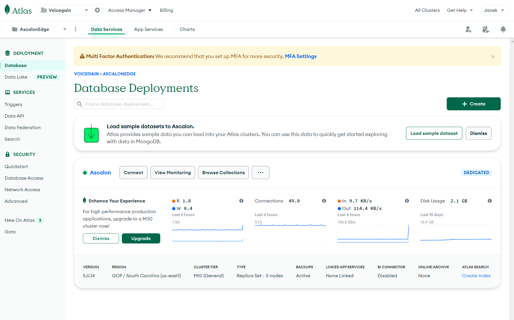
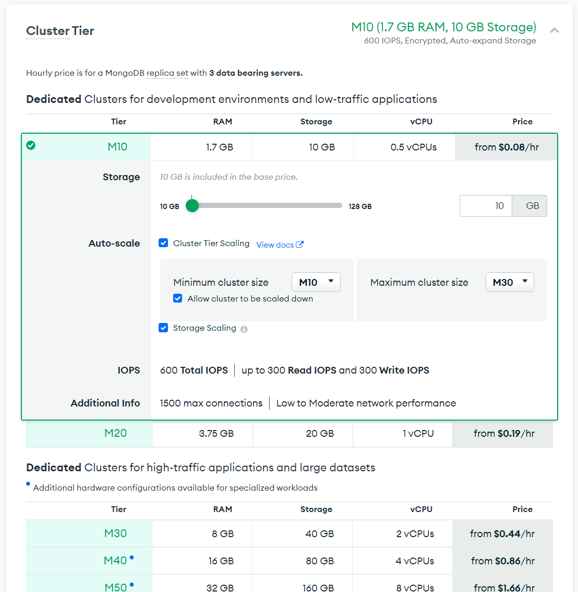
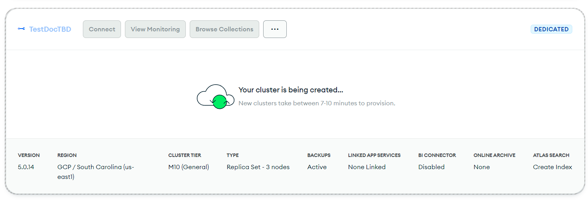

# Setup Atlas MongoDB for use with Voicegain Edge Deployment

First you need to have an Atlas account. If you need to create it, [here are the instructions](https://www.mongodb.com/docs/atlas/tutorial/create-atlas-account/).

Within a new acocunt you will need to create an Organization and then a Project. Project is  used to organize databases and manage access to them. Within a Project you can invite Users, create Teams, generate API Keys.

Here is a link to [Atlas MongoDB Login](https://account.mongodb.com/account/login)

## Creating a new database deployment within a project

Here is a view of database deployments within a Project.

For each Voicegain Edge you should create a separate Database Deployment.

We recommend that you use a Dedicated cluster using a Cloud provider and region of your choice.

Size of the required database depends on a lot of factors. Fortunately, we can rely on Atlas autoscaling, so we can safely start with M10 Tier and allow it to scale up (initially to M30).

We suggest running realistic load tests before moving to production use.

Then you can choose Backup and other settings.

Finally, give your DB cluster a name.

It will take a few minutes to create the cluster

Eventually it will be ready

## Conencting to the new MongoDB cluster

For connection you will need:
- **Connection type**, either
  - Private IP for Peering, or
  - Standard Connection (public Internet IP)
- **IP access list** - particularly important if you choose Standard Connection
- **Database User**

