# Setup Atlas MongoDB for use with Voicegain Edge Deployment

First you need to have an Atlas account. If you need to create it, [here are the instructions](https://www.mongodb.com/docs/atlas/tutorial/create-atlas-account/).

Within a new acocunt you will need to create an Organization and then a Project. Project is  used to organize databases and manage access to them. Within a Project you can invite Users, create Teams, generate API Keys.

Here is a link to [Atlas MongoDB Login](https://account.mongodb.com/account/login)

## Creating a new database deployment within a project

Here is a view of database deployments within a Project.

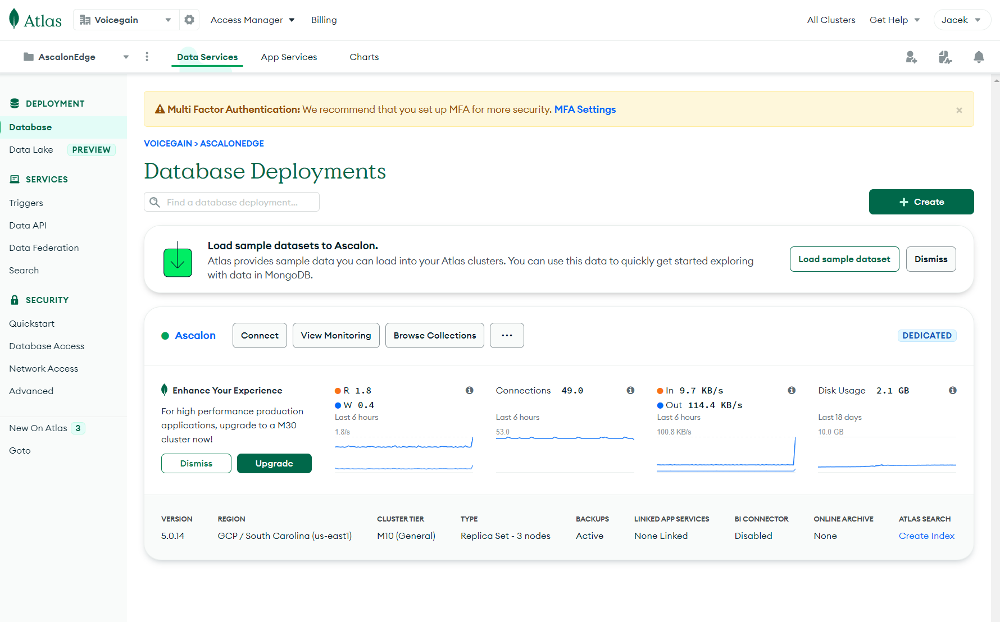

For each Voicegain Edge you should create a separate Database Deployment.

We recommend that you use a Dedicated cluster using a Cloud provider and region of your choice.

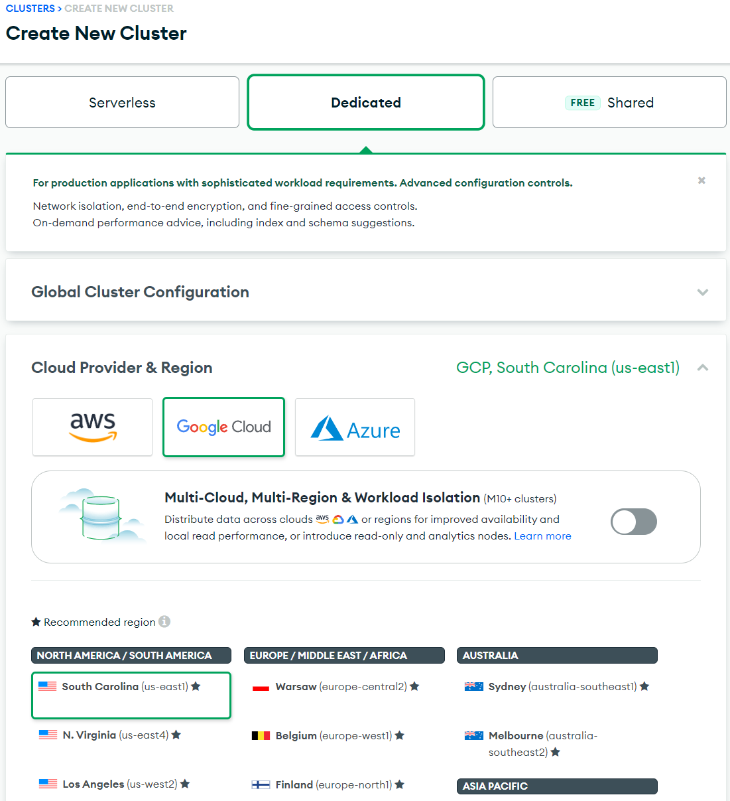

Size of the required database depends on a lot of factors. Fortunately, we can rely on Atlas autoscaling, so we can safely start with M10 Tier and allow it to scale up (initially to M30).

We suggest running realistic load tests before moving to production use.

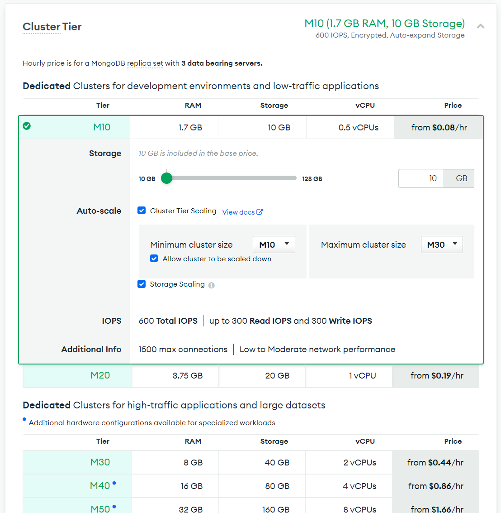

Then you can choose Backup and other settings.

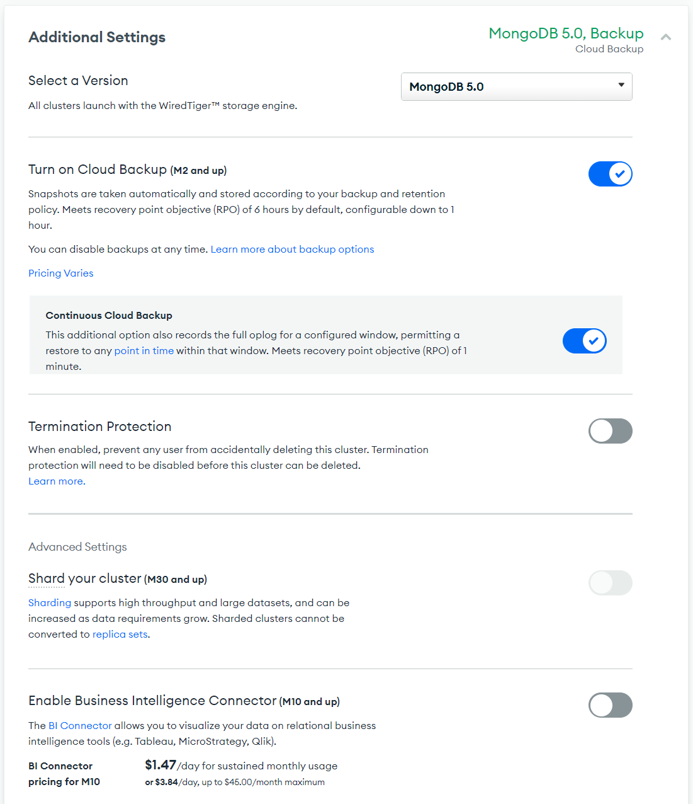

Finally, give your DB cluster a name.

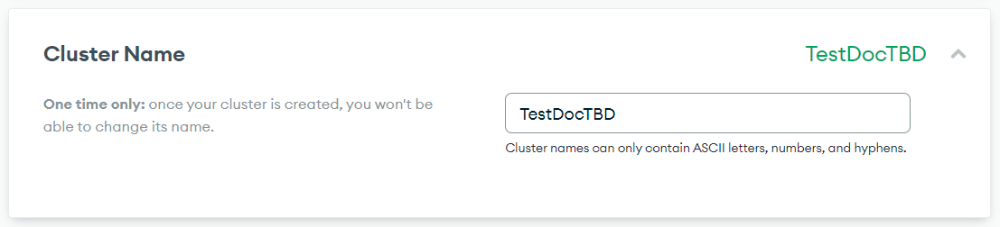

If it is a first DB in a Project you will be presented with a Security Quickstart

First you will need to create a user:

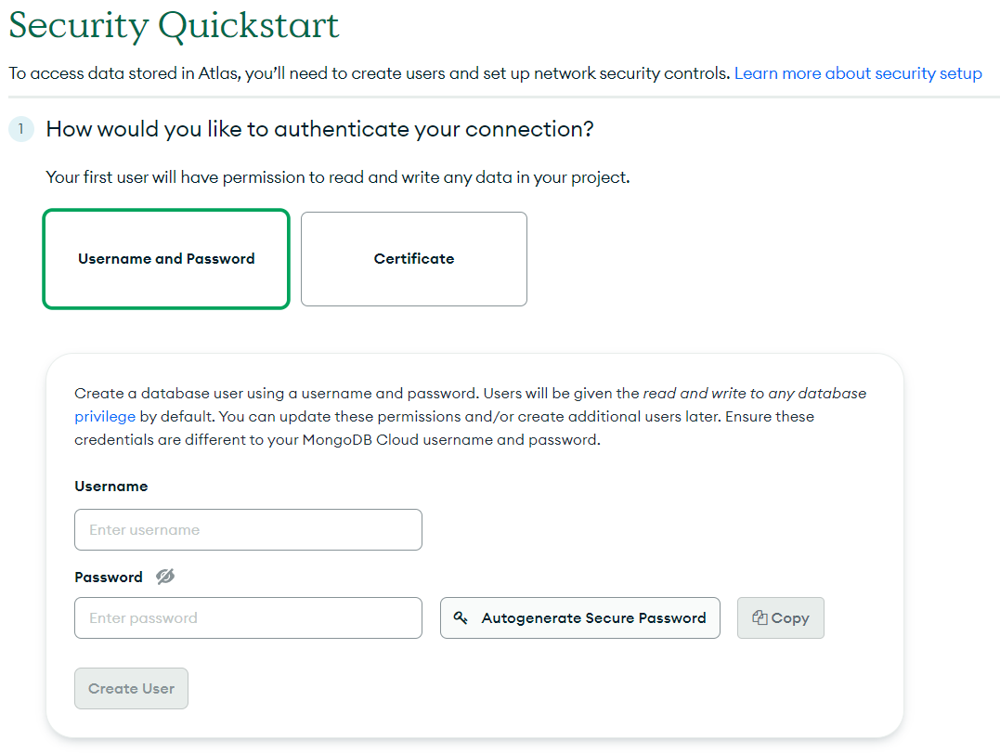

Then you need to specify and configure how you will connect to MongoDB.
We suggest using VPC Peering.

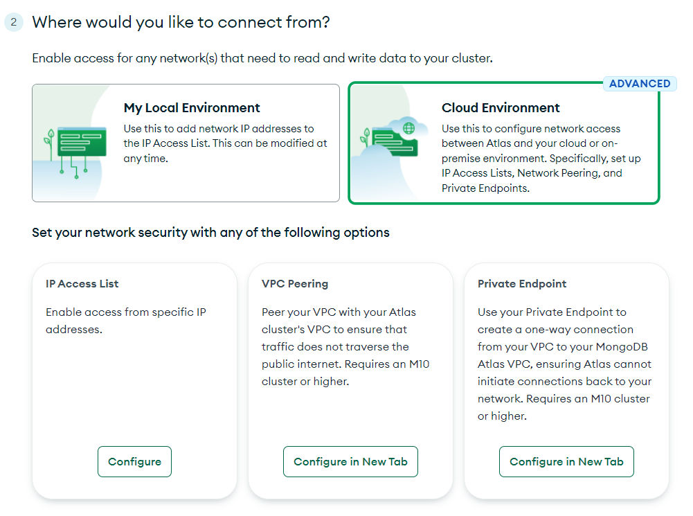

To setup Peering you will need to make changes both on Atlas and in your Cloud (e.g. GCP) network configuration. The final result will be an established (Available) connection.

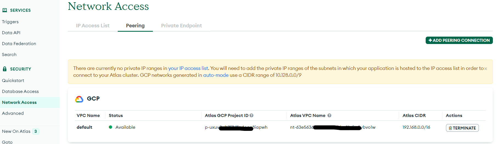

Going back to cluster creation -- It will take a few minutes to create the cluster

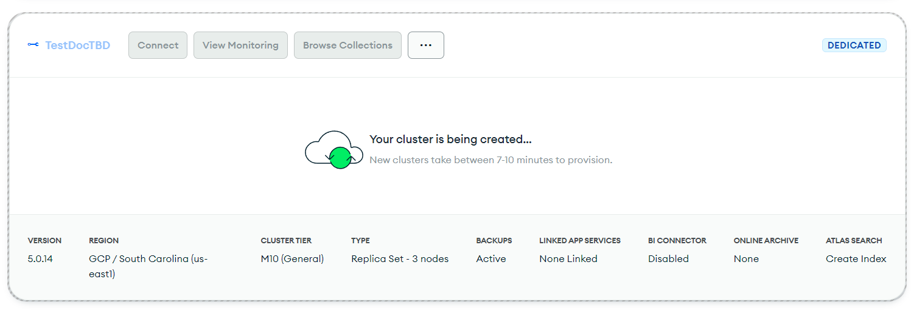

Eventually it will be ready

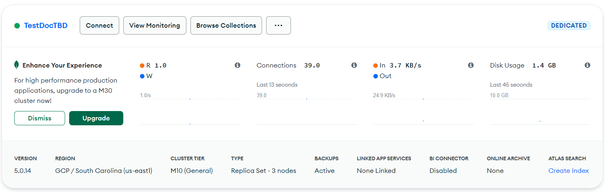

## Connecting to the new MongoDB cluster

If you configured VPC Peering you will get an option to choose it, otherwise you will just choose the IPs from which the connection is to be allowed.

You can use a previously created User or create a new one.

On the next page please choose "Connect your application"

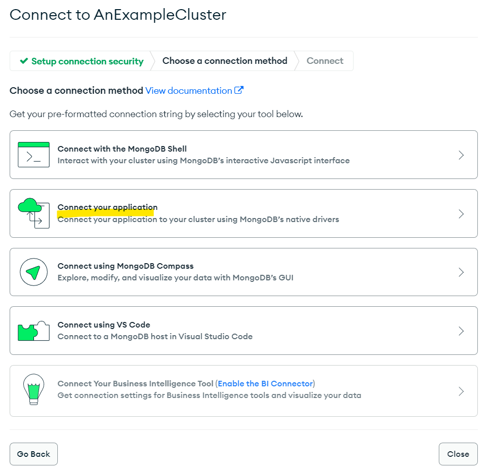

On the next page please choose Java and version "4.3 or later" and the copy the URL shown. It will be used to connect Voicegain Edge Deployment to Mongo. Of course, we will need the password too.

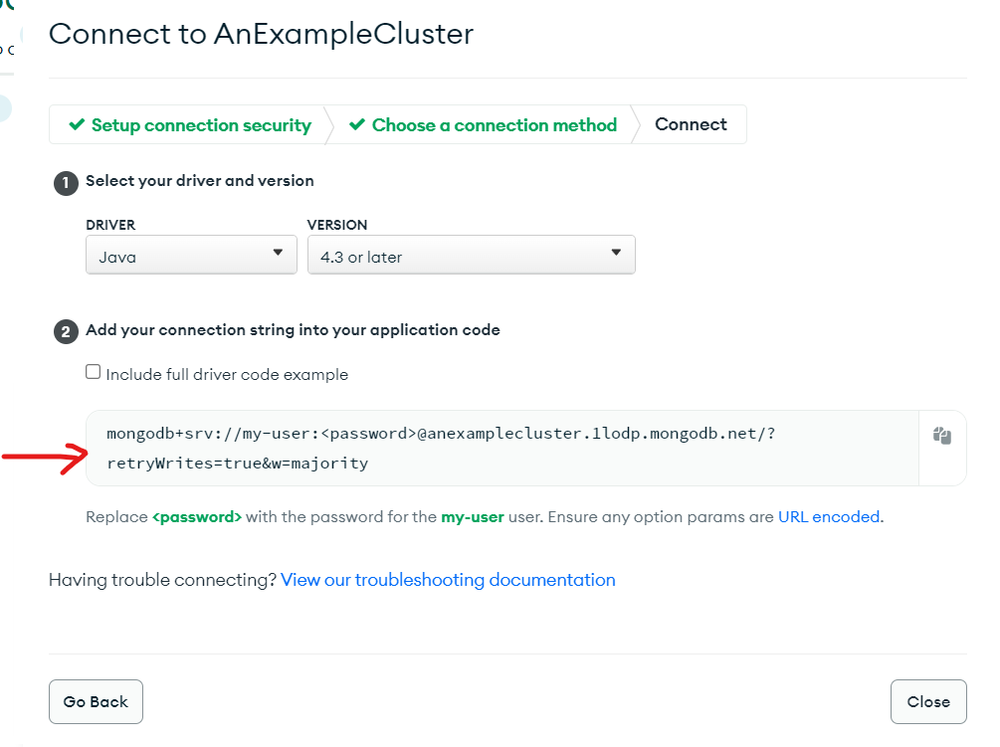

