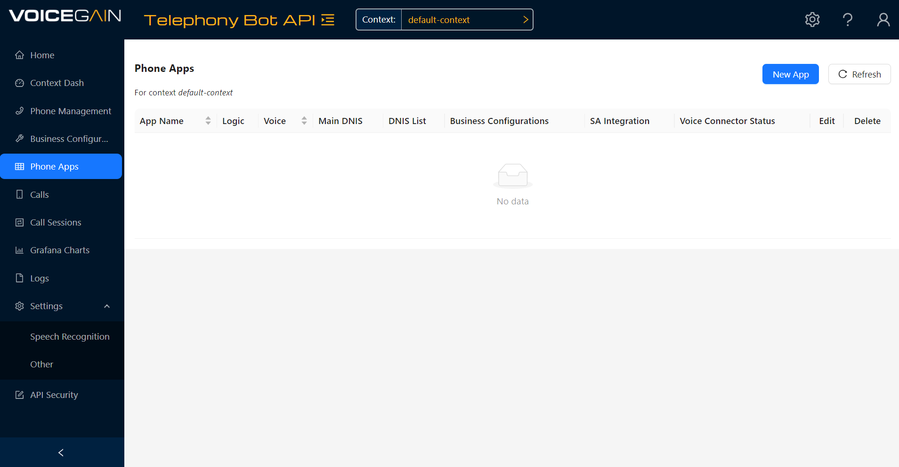
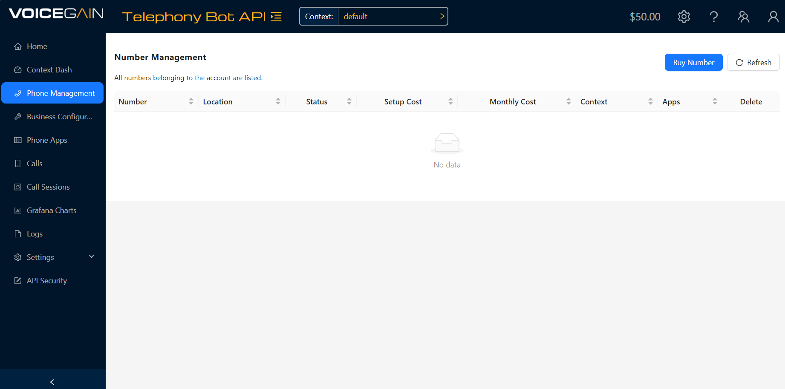
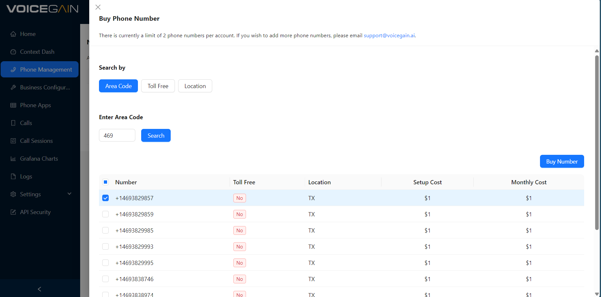
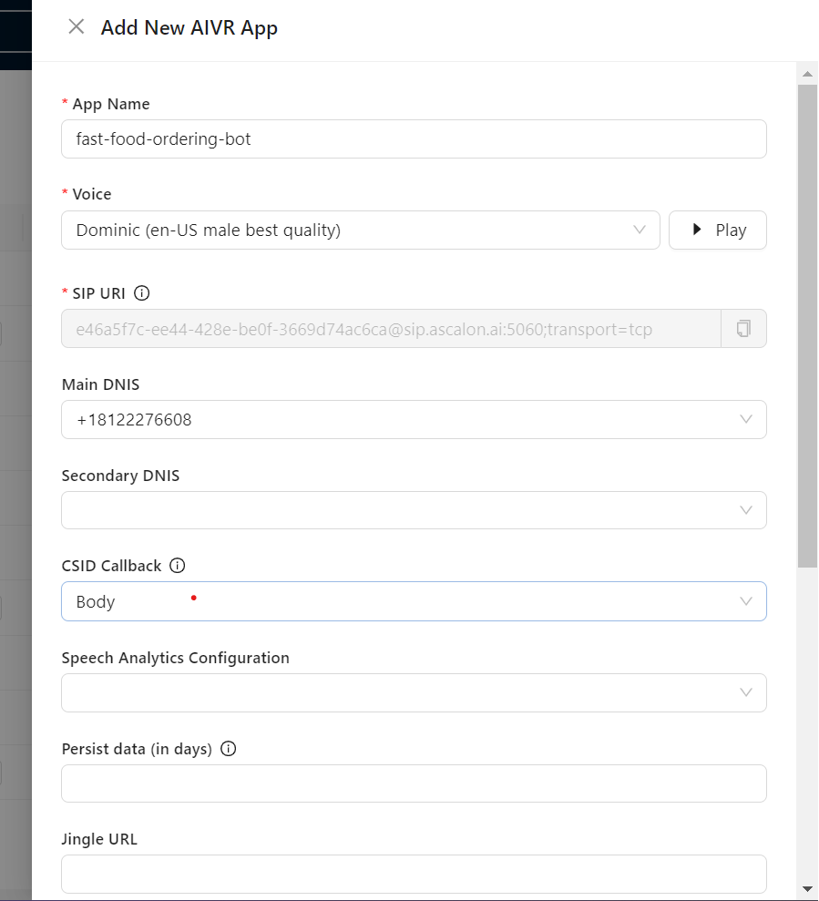
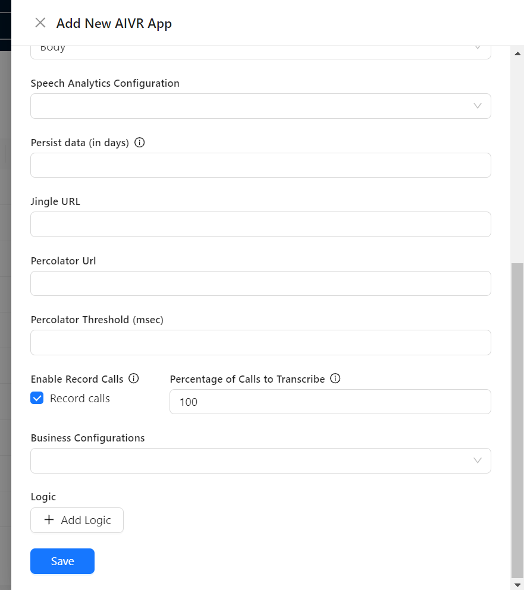
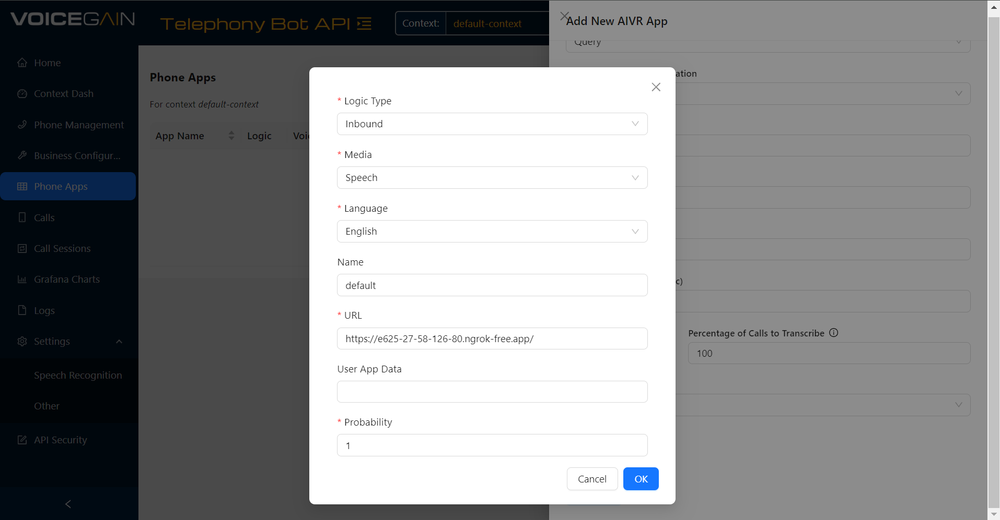
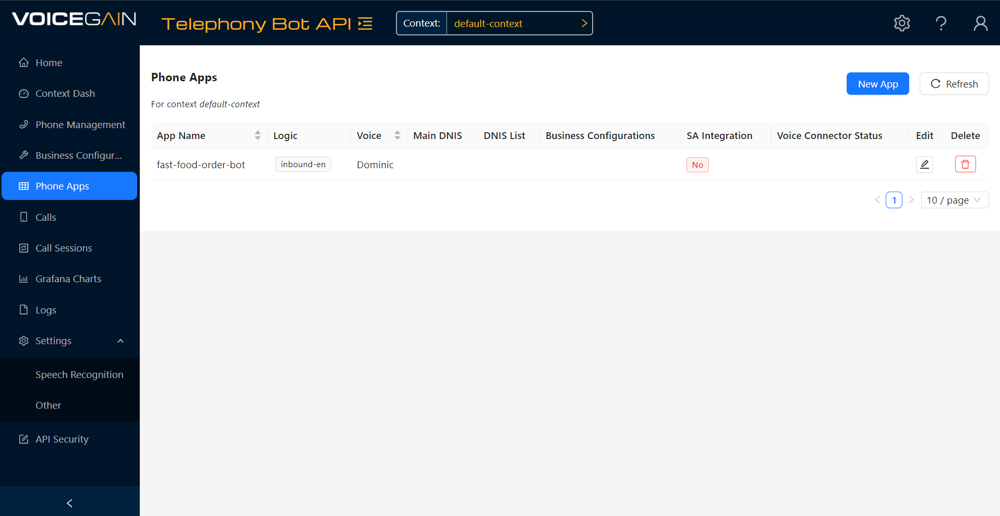

# Project Overview

The Project is to create a fast food ordering voicebot using Langchain and Voicegain Telephony Bot API. 
The bot has the ability to order from a predefined menu that includes burgers, wraps, drinks, fries and potato wedges. 
The bot can distinguish between all vegetarian items and non-veg items. 
The user has the ability to customize their order by adding topics / add-ons to their burger or wrap 
and have the ability to pick from 3 different sizes for the fries and potato wedges. 
They can further create custom combo orders and have a choice between 3 - main item with a drink, 
main item with a side of their fries or potato wedges, main with a side and a drink. 
If an order qualifies for a combo order - the bot automatically creates a combo for the user. 
The bot can summarize the users order at any point along with calculating the total cost of the order. 
The user can further edit their order at any point - by either changing an item (replace item, change quantity etc) 
or deleting an item entirely.

# Project Steps

There are mainly 3 steps to it - 
- Implement the Bot Logic
- Implement a Telephony Bot API service
- Setting up the AIVR bot on Voicegain Customer Portal. 

Each of these work hand in hand to create the bot.

## 1. Bot Logic

For the bot logic, we use LangChain which is a framework to build with LLMs by chaining interoperable components. 
This helps in managing the workflow of the bot. 

For Langchain Reference kindly refer the Documentation here - https://python.langchain.com/v0.2/docs/introduction/

If the reader is interested in the detailed bot implementation, kindly read through --- 

The bot logic is powered by LangChain and OpenAI's API. 
In order to create the bot framework, chains are used to link the various functions that the bot can perform. 
By using tools, the program is able to create a basic function framework that ChatGPT can use depending on the task. 
It is important to note that the function description is key as this informs ChatGPT 
what the function of each of these functions are, and can respectively pick the appropriate function for the task. 
This logic for bot is present in [fast_food_bot.py](fast_food_bot.py).

The core functions are therefore created as tool functions in LangChain. 
Functions such as giving the order summary and the total order cost have their own function as well, 
so as to prevent possible errors arising from ChatGPT.

### 1.1 Tools

- get_menu: Returns the menu and prices for burgers, wraps, fries, wedges, and drinks.
- get_add_ons: Lists all possible add-ons and their costs.
- get_combos(main_item, side=None, drink=None): Provides possible meal combos based on user selections.
- update_order(new_order: OrderItem): Updates the current order, handles adding, updating, and deleting items.
- get_final_price: Calculates the total price of the current order.
- get_breakdown: Provides a detailed breakdown of the current order.

### 1.2 Agents and Chains

- ChatPromptTemplate: Defines the conversation prompt template.
- create_tool_calling_agent: Creates an agent that uses the defined tools and prompt.
- AgentExecutor: Manages the execution of the agent with tools.
- RunnableWithMessageHistory: Manages conversation history and processes the inputs

### 1.3 Steps to run the bot locally -

- Install the requirements in requirements.txt
- Set your openai api key in 'fast_food_bot.py' file.
- Run the main.py file to start the local uvicorn server.
- Run the http_client_example now to interact with the bot via text.

## 2. Telephony Bot API Integration

Reference Document: https://console.voicegain.ai/api-documentation#tag/aivr-callback

Implement POST / PUT / DELETE

- POST: We create a new call session with unique 'csid'. They can be used to uniquely identify the call.
- PUT: If we get user output, call CHAIN to relay information to the bot. If not, reprompt the user for a response.
- DELETE: Delete the session from Chain's memory

This is the component that integrates Voicegain's Telephony Bot API with the function of the langChain bot. 
This adds the ability to interact with the bot through speech, rather than text, 
thereby enhancing the user interaction experience. This logic is present in [main.py](main.py).

### 2.1 Functions

- create_session(request: TelephonyBotPostReq): Adds a new call session with unique sid, csid.
- update_session(request: TelephonyBotPutReq): Updates an existing order using the sid, csid based on the user input. Forwards input to the Fast Food Bot and returns the response.
- delete_session(request: TelephonyBotDeleteReq): Removes the call session and associated chat history from the in-memory store by csid.

## 3. Create AIVR App on Voicegain Portal.

By making an AIVR App on the Voicegain Portal, we can enable the speech component to our food ordering bot. This has mainly 3 steps - 

- Hosting Bot on a server
- Providing the URL in the AIVR App created on the Voicegain Portal

We explore these steps in detail below.

### 3.1 Hosting Bot on Server

When you've run the [main.py](main.py) file and the bot is running locally on your device, you need to host the bot on a public URL for using on AIVR app.
One of the options for that is to use Ngrok - https://dashboard.ngrok.com/get-started/setup/windows

### 3.2 Setting up AIVR App

After you've configured the public URL for the food ordering bot, we need to setup the AIVR App using the following steps - 

1. Login to the Voicegain console - https://console.voicegain.ai/specific/aivr-apps 
2. Buy a phone number in the phone management section. Click on buy number, add your area code and buy. This will be used later in the Main DNS field for AIVR App.   
3. Now move to 'Phone Apps' section from 'Phone Management' in the toolbar on the left. Add new AIVR App using the blue button on top-right and filling in the details. Remember to add the number you purchased in the 'Main DNIS' section.  
4. Click on Add Logic at the end and fill in details. The public URL where you host the bot goes in here 
5. After that click on OK and Save to save your AIVR bot. You should get a screen like this with a number in Main DNIS field - 

Now you can call on the phone number in the Main DNIS and you can use the food ordering bot on call.

### Credits - 
Voicegain Team